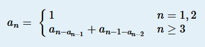
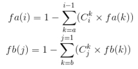
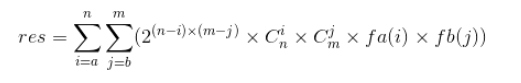

* [Multi-University contest 1](http://acm.hdu.edu.cn/userloginex.php?cid=802)
* [Multi-University contest 2](http://acm.hdu.edu.cn/userloginex.php?cid=803)

## 1_1001. Maximum Multiple （打表找规律）
* **题目大意** ： 给定n，求n的3个因子乘积最大值，满足3个因子的和为n。
* **大体思路** ： 只知道这三个因子要尽量接近`n / 3`，没想太多直接打表找规律了。结论是： 若n是3的倍数则`n ^ 3 / 27`，若是4的倍数则`n ^ 3 / 32`，否则不存在。
```c++
#include <bits/stdc++.h>

using namespace std;
long long n, ct;

int main() {

    ios::sync_with_stdio(false), cin.tie(nullptr), cout.tie(nullptr);
    cin >> ct;
    while (ct--) {
        cin >> n;
        cout << (n % 3 ? (n % 4 ? -1 : (n * n * n / 32)) : (n * n * n / 27)) << endl;
    }

    return 0;
}
```

## 1_1002. Balanced Sequence （排序 + 贪心）
* **题目大意** ： 给定n个只含小括号的字符串，以任意顺序拼接并删除多余的括号后，求剩余匹配的括号字符串最大长度。
* **大体思路** ： 预处理每个字符串，分别记录内部已经匹配的括号个数，多出的`(`个数，多出的`)`个数。然后考虑如何排序，贪心的大体意图是尽量让`(`多的优先，因为这样可以和之后的多出的`)`匹配。若一个`(`较多另一个较少则前者优先，反之后者优先； 若`(`都比`)`多时，要让`)`数量少的优先； 若`(`都少则要让`(`数量大的优先。最后模拟一下即可。

```c++
#include <bits/stdc++.h>

using namespace std;

const int maxn = int(1e5 + 5);
char s[maxn];
int n, ct;

struct data {

    int l, r, ct;
    bool operator<(const data &t) const {

        if (l > r and t.l <= t.r) return true;      //'('多的优先
        if (l <= r and t.l > t.r) return false;
        if (l > r and t.l > t.r) return r < t.r;    //都有多余的'('，则')'少的优先
        return l > t.l;                             //')'都比较多，则'('多的优先
    }
} a[maxn];

void solve() {

    cin >> n;
    memset(a, 0, sizeof(a));
    for (int i = 0; i < n; i++) {
        cin >> s;
        for (int j = 0, len = strlen(s); j < len; j++) {
            if (s[j] == '(') a[i].l++;
            else {
                if (a[i].l) a[i].l--, a[i].ct++;
                else a[i].r++;
            }
        }
    }
    sort(a, a + n);
    int left = 0, res = 0;
    for (int i = 0; i < n; i++) {
        a[i].r = min(a[i].r, left); //')'与多出来的'('匹配
        res += a[i].r + a[i].ct;
        left += a[i].l - a[i].r;    //加上多出来的'('
    }
    cout << 2 * res << endl;
}
int main() {

    ios::sync_with_stdio(false), cin.tie(nullptr), cout.tie(nullptr);
    cin >> ct;
    while (ct--) solve();

    return 0;
}
```

## 1_1003. Triangle Partition （计算几何）
* **题目大意** ： 给定3n个点的坐标，保证三点不共线，求如何构建n个不相交的三角形。
* **大体思路** ： 因为三点不共线，按坐标升序排序，每次输出3个索引即可。
```c++
#include <bits/stdc++.h>

using namespace std;

struct ppp {

    int x, y, id;
    bool operator < (const ppp &t) const {
        return x < t.x or x == t.x and y < t.y;
    }
} a[3005];
int ct, n, m;

void solve() {

    cin >> n;
    m = 3 * n;
    for (int i = 0; i < m; i++) {
        cin >> a[i].x >> a[i].y;
        a[i].id = i + 1;
    }
    sort(a, a + m);
    for (int i = 0; i < m; i += 3) {
        cout << a[i].id << ' ' << a[i + 1].id << ' ' << a[i + 2].id << endl;
    }
}
int main() {

    ios::sync_with_stdio(false), cin.tie(nullptr), cout.tie(nullptr);
    cin >> ct;
    while (ct--) solve();

    return 0;
}
```

## 1_1004. Distinct Values （贪心）
* **题目大意** ： 构造长度为n的字典序最小序列，条件是m个`[l, r]`区间内不能有重复数字。
* **大体思路** ： 典型贪心题，要字典序最小则每次填入尽量小的数。记录每个位置最前的不能重复的索引，用set维护能填入的最小数，每次将这个区间前面的已填好的较小数添进set，每次填入set中最小数并从set中删除即可。
```c++
#include <bits/stdc++.h>

using namespace std;

const int maxn = int(1e5 + 5);

set<int> all;
int pre[maxn], res[maxn];
int n, m, ct, l, r;

void solve() {

    all.clear();
    cin >> n >> m;
    for (int i = 0; i < n; i++) all.insert(i + 1), pre[i] = i;
    while (m--) {
        cin >> l >> r;
        pre[r - 1] = min(pre[r - 1], l - 1);
    }
    for (int i = n - 1; i; i--) pre[i - 1] = min(pre[i - 1], pre[i]);

    for (int i = 0, t = 0; i < n; i++) {
        while (t < pre[i]) all.insert(res[t++]);
        res[i] = *all.begin();
        all.erase(res[i]);
    }
    for (int i = 0; i < n - 1; i++) cout << res[i] << ' ';
    cout << res[n - 1] << endl;
}
int main() {

    ios::sync_with_stdio(false), cin.tie(nullptr), cout.tie(nullptr);
    cin >> ct;
    while (ct--) solve();

    return 0;
}
```

## 1_1007. Chiaki Sequence Revisited （打表找规律 + 二分）
* **题目大意** ： 给定如下函数递推式，求前n项和(n ≤ 1e18)。



* **大体思路** ： 打表找规律，可以发现除去第一项的1之外，每个数出现次数规律如下：

```
出现1次：1, 3, 5, 7...
出现2次：2, 6, 10, 14...
出现3次：4, 12, 20, 28...
出现4次:8, 24, 40, 56...
出现i次：2^(i-1), 2^(i-1) + 2^i... 
```

* 即每组都是等差数列，出现i次的数构成的数列首项为`2 ^ (i - 1)`，公差为`2 ^ i`。由a[n]推出n比较容易，不妨用 **二分搜索** 求出第n项a[n]。然后把前缀和分成两部分:后面连续等于a[n]的数，前面`1~a[n]-1`的数的和。打出2的幂数表然后枚举等差数列的首项，从而分别求出前面每个数列的和。两部分相加即可 （模运算好坑）。

```c++
#include<bits/stdc++.h>

using namespace std;
typedef long long LL;

const int mod = int(1e9 + 7);

LL b[63] = {1}, n;
int ct;

LL work(LL x) {

    LL res = 0;
    while (x) {
        res += x;
        x >>= 1;
    }
    return res;
}
void solve() {

    cin >> n;
    if (!--n) {
        cout << 1 << endl;
        return;
    }
    LL l = 0, r = n + 1, m;
    while (r - l > 1) {
        if (work(m = (l + r) / 2) < n) l = m;  //找到 (fun ≤ n) 的最大值
        else r = m;                             //r -> f[n], l = r - 1
    }
    LL res = ((n - work(l)) % mod) * (r % mod) % mod;

    for (int i = 1; b[i - 1] < r; i++) {
        LL k = ((r - 1 - b[i - 1]) / b[i] + 1) % mod;
        LL sum = (b[i - 1] % mod * k % mod + k * (k - 1) / 2 % mod * (b[i] % mod) % mod) % mod;
        res = (res + i * sum % mod) % mod;
    }
    cout << (res + 1 + mod) % mod << endl;
}

int main() {

    ios::sync_with_stdio(false), cin.tie(nullptr), cout.tie(nullptr);
    for (int i = 1; i < 63; i++) b[i] = 2 * b[i - 1];
    cin >> ct;
    while (ct--) solve();

    return 0;
}

```
## 1_1011. Time Zone （模拟）
* **题目大意** ： 给定24时制时间和时区，求东八区时间。
* **大体思路** ： 确定时区符号，小时转分钟，特判负数，前缀0，浮点数+0.1，这些都注意到就好了。
```c++
#include <bits/stdc++.h>

using namespace std;

const int mod = 1440;
int ct, a, b, res, sign;
char x[50];

void solve() {

    scanf("%d%d%s", &a, &b, x);
    sign = x[3] == '+' ? 1 : -1;
    res = (6 * sign * int(10 * atof(x + 4) + 0.1) + a * 60 + b - 480 + mod) % mod;
    printf("%02d:%02d\n", res / 60, res % 60);
}
int main() {

    cin >> ct;
    while (ct--) solve();

    return 0;
}
```


## 2_1004. Game （博弈论 / 规律）
* **题目大意** ： 2人删除从`1~n`的数字，每次删一个数并删除其所有因子，2人都采取最优策略，问先手是赢是输。
* **大体思路** ： 这题先手要么必胜要么必输，因为1是任何数的因子，先删其他任何数都将把1删掉。假设后手必胜，那么先手只需先把1删掉即可变成先手必胜。其实打出20个表发现全是`Yes`也应该大胆猜一下先手稳赢。

```c++
#include <bits/stdc++.h>

int main() {
    
    for (int n; std::cin >> n; puts("Yes"));
    
    return 0;
}
```

## 1005. Hack It （数论 + 构造）
* **题目大意** ： 构造一个n*n`(1 ≤ n ≤ 2000)`的01方阵，要求1个数大于85000且任意子矩阵4个对角不能都为1。
* **大体思路** ： 一种数论构造方法是先让1尽量出现在同一列，再在之后每一列保证每一列只出现1次，例如`n = 5`如下所示：
```
10000 01000 00100 00010 00001 
10000 00100 00001 01000 00010 
10000 00010 01000 00001 00100 
10000 00001 00010 00100 01000 
10000 10000 10000 10000 10000

01000 00100 00010 00001 10000 
01000 00010 10000 00100 00001 
01000 00001 00100 10000 00010 
01000 10000 00001 00010 00100 
01000 01000 01000 01000 01000 
...
```

* 这样构成了一个`n * (n * n)`的矩阵，考虑将都矩阵中的5个小方阵向右移动一列，即列序号加1取模。这样就构成不一样的新矩阵（如上图），同理构造剩余矩阵即可满足条件。因为涉及到取模运算，方阵中每个小方阵都唯一的充要条件是n是素数。尝试多个素数后发现`n = 47`时能让`2000 * 2000`的方阵中1的次数为`85105`满足题意。

```c++
#include<bits/stdc++.h>

using namespace std;

const int maxn = 2500;
int a[maxn][maxn], n = 47, m = n * n, res = 2000;

int main() {

    ios::sync_with_stdio(false), cin.tie(), cout.tie();

    cout << res << endl;
    for (int k = 0; k < m; k++) {
        for (int i = 0; i < n; i++) {
            a[k][i * n + ((k % n + 1) * i + k / n) % n] = 1;
        }
    }
    for (int i = 0; i < res; i++) {
        for (int j = 0; j < res; j++) {
            cout << a[i][j];
        } cout << endl;
    }

    return 0;
}
```

## 2_1006. Matrix （容斥原理 + 编程风格）
* **题目大意** ： 在n*m的矩阵中染黑色或白色，求全黑的行数至少为a，全黑的列数至少为b的方案数。
* **大体思路** ： 只考虑全黑的行数的话，所有情况是`C{n}{i} * 2 ^ (n - i)`，设 **容斥系数** 为`fa(n)`表示有n行全黑，那么染色方案数如下：


* 对于任何小于全黑行数i的k，`fa(i)`都出现在`fa(k)`中出现过`C{i}{k}`次，所以容斥系数必须减去所有多求的答案次数，容斥系数递推式如下：



* 然后将行与列整合起来得到答案如下。其中`fa(i)`，`fb(j)`和前面的系数都可以在 **O(n^2)** 时间内预处理出来，再用相同的复杂度即可求出答案，但是这题卡时间卡的特别死，需要点优秀的 **C语言程风格** 以及良好的 **心理承受能力** 。




```c++
#include <bits/stdc++.h>

using namespace std;
typedef long long LL;
const LL mod = 998244353;
#define maxn 3005
LL c[maxn][maxn], g[maxn][maxn];
LL fa[maxn], fb[maxn];
LL bin[maxn * maxn], res;
int n, m, a, b, i, j;

int main() {

    bin[0] = 1;
    for (i = 1; i < 9000005; i++) bin[i] = bin[i - 1] * 2 % mod;
    for (i = 0; i < maxn; i++) c[i][0] = 1;
    for (n = 1; n < maxn; n++) {
        for (i = 1; i <= n; i++) c[n][i] = (c[n - 1][i - 1] + c[n - 1][i]) % mod;
    }

    while (scanf("%d%d%d%d", &n, &m, &a, &b) != -1) {

        for (i = a; i <= n; i++) {
            fa[i] = 1;
            for (j = a; j < i; j++) fa[i] = (fa[i] - c[i][j] * fa[j]) % mod;
        }
        for (i = b; i <= m; i++) {
            fb[i] = 1;
            for (j = b; j < i; j++) fb[i] = (fb[i] - c[i][j] * fb[j]) % mod;
        }
        for (i = a; i <= n; i++) {
            for (j = b; j <= m; j++) {
                g[i][j] = c[n][i] * c[m][j] % mod * bin[(n - i) * (m - j)] % mod;
            }
        }
        res = 0;
        for (i = a; i <= n; i++) {
            for (j = b; j <= m; j++) {
                res = (res + fa[i] * fb[j] % mod * g[i][j]) % mod;
            }
        }
        printf("%lld\n", (res + mod) % mod);
    }

    return 0;
}
```

## 2_1010. Swaps and Inversions （树状数组 / 逆序数）
* **题目大意** ： 每次支付x或y交换相邻两数使数组升序，求最小支付多少。
* **大体思路** ： 显然交换顺序与结果无关，只需求出逆序数为res，答案即为`res * min(x, y)`，在归并排序时顺便求一下逆序数即可。

```c++
#include<bits/stdc++.h>

using namespace std;
typedef long long LL;

const int maxn = int(1e5 + 7);
int a[maxn], b[maxn], num[maxn];
int n, x, y;
LL res;

void Merge(int l, int m, int r) {

    int id1 = 0, id2 = 0;
    int n1 = 0, n2 = 0;
    for (int i = l; i < m; i++) a[n1++] = num[i];
    for (int i = m; i < r; i++) b[n2++] = num[i];

    for (int i = l; i < r; i++) {
        if (id1 == n1) {    //a取完了
            num[i] = b[id2++];
            continue;
        }
        if (id2 == n2) {    //b取完了
            num[i] = a[id1++];
            continue;
        }
        if (a[id1] <= b[id2]) num[i] = a[id1++];
        else num[i] = b[id2++], res += n1 - id1;    //若a>b，加上逆序数
    }
}
void MergeSort(int l, int r) {

    if (l == r - 1) return;
    int m = (l + r) / 2;
    MergeSort(l, m);
    MergeSort(m, r);
    Merge(l, m, r);
}
int main() {

    ios::sync_with_stdio(false), cin.tie(), cout.tie();
    while (cin >> n >> x >> y) {
        for (int i = 0; i < n; i++) cin >> num[i];
        res = 0;
        MergeSort(0, n);
        cout << res * min(x, y) << endl;
    }

    return 0;
}
```