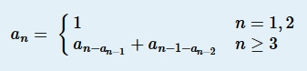

* [Multi-University contest 1](http://acm.hdu.edu.cn/userloginex.php?cid=802)
## 1001. Maximum Multiple （打表找规律）
* **题目大意** ： 给定n，求n的3个因子乘积最大值，满足3个因子的和为n。
* **大体思路** ： 只知道这三个因子要尽量接近`n / 3`，没想太多直接打表找规律了。结论是： 若n是3的倍数则`n ^ 3 / 27`，若是4的倍数则`n ^ 3 / 32`，否则不存在。
```c++
#include <bits/stdc++.h>

using namespace std;
long long n, ct;

int main() {

    ios::sync_with_stdio(false), cin.tie(nullptr), cout.tie(nullptr);
    cin >> ct;
    while (ct--) {
        cin >> n;
        cout << (n % 3 ? (n % 4 ? -1 : (n * n * n / 32)) : (n * n * n / 27)) << endl;
    }

    return 0;
}
```

## 1002. Balanced Sequence （排序 + 贪心）
* **题目大意** ： 给定n个只含小括号的字符串，以任意顺序拼接并删除多余的括号后，求剩余匹配的括号字符串最大长度。
* **大体思路** ： 预处理每个字符串，分别记录内部已经匹配的括号个数，多出的`(`个数，多出的`)`个数。然后考虑如何排序，贪心的大体意图是尽量让`(`多的优先，因为这样可以和之后的多出的`)`匹配。若一个`(`较多另一个较少则前者优先，反之后者优先； 若`(`都比`)`多时，要让`)`数量少的优先； 若`(`都少则要让`(`数量大的优先。最后模拟一下即可。

```c++
#include <bits/stdc++.h>

using namespace std;

const int maxn = int(1e5 + 5);
char s[maxn];
int n, ct;

struct data {

    int l, r, ct;
    bool operator<(const data &t) const {

        if (l > r and t.l <= t.r) return true;      //'('多的优先
        if (l <= r and t.l > t.r) return false;
        if (l > r and t.l > t.r) return r < t.r;    //都有多余的'('，则')'少的优先
        return l > t.l;                             //')'都比较多，则'('多的优先
    }
} a[maxn];

void solve() {

    cin >> n;
    memset(a, 0, sizeof(a));
    for (int i = 0; i < n; i++) {
        cin >> s;
        for (int j = 0, len = strlen(s); j < len; j++) {
            if (s[j] == '(') a[i].l++;
            else {
                if (a[i].l) a[i].l--, a[i].ct++;
                else a[i].r++;
            }
        }
    }
    sort(a, a + n);
    int left = 0, res = 0;
    for (int i = 0; i < n; i++) {
        a[i].r = min(a[i].r, left); //')'与多出来的'('匹配
        res += a[i].r + a[i].ct;
        left += a[i].l - a[i].r;    //加上多出来的'('
    }
    cout << 2 * res << endl;
}
int main() {

    ios::sync_with_stdio(false), cin.tie(nullptr), cout.tie(nullptr);
    cin >> ct;
    while (ct--) solve();

    return 0;
}
```

## 1003. Triangle Partition （计算几何）
* **题目大意** ： 给定3n个点的坐标，保证三点不共线，求如何构建n个不相交的三角形。
* **大体思路** ： 因为三点不共线，按坐标升序排序，每次输出3个索引即可。
```c++
#include <bits/stdc++.h>

using namespace std;

struct ppp {

    int x, y, id;
    bool operator < (const ppp &t) const {
        return x < t.x or x == t.x and y < t.y;
    }
} a[3005];
int ct, n, m;

void solve() {

    cin >> n;
    m = 3 * n;
    for (int i = 0; i < m; i++) {
        cin >> a[i].x >> a[i].y;
        a[i].id = i + 1;
    }
    sort(a, a + m);
    for (int i = 0; i < m; i += 3) {
        cout << a[i].id << ' ' << a[i + 1].id << ' ' << a[i + 2].id << endl;
    }
}
int main() {

    ios::sync_with_stdio(false), cin.tie(nullptr), cout.tie(nullptr);
    cin >> ct;
    while (ct--) solve();

    return 0;
}
```

## 1004. Distinct Values （贪心）
* **题目大意** ： 构造长度为n的字典序最小序列，条件是m个`[l, r]`区间内不能有重复数字。
* **大体思路** ： 典型贪心题，要字典序最小则每次填入尽量小的数。记录每个位置最前的不能重复的索引，用set维护能填入的最小数，每次将这个区间前面的已填好的较小数添进set，每次填入set中最小数并从set中删除即可。
```c++
#include <bits/stdc++.h>

using namespace std;

const int maxn = int(1e5 + 5);

set<int> all;
int pre[maxn], res[maxn];
int n, m, ct, l, r;

void solve() {

    all.clear();
    cin >> n >> m;
    for (int i = 0; i < n; i++) all.insert(i + 1), pre[i] = i;
    while (m--) {
        cin >> l >> r;
        pre[r - 1] = min(pre[r - 1], l - 1);
    }
    for (int i = n - 1; i; i--) pre[i - 1] = min(pre[i - 1], pre[i]);

    for (int i = 0, t = 0; i < n; i++) {
        while (t < pre[i]) all.insert(res[t++]);
        res[i] = *all.begin();
        all.erase(res[i]);
    }
    for (int i = 0; i < n - 1; i++) cout << res[i] << ' ';
    cout << res[n - 1] << endl;
}
int main() {

    ios::sync_with_stdio(false), cin.tie(nullptr), cout.tie(nullptr);
    cin >> ct;
    while (ct--) solve();

    return 0;
}
```

## 1007. Chiaki Sequence Revisited （打表找规律 + 二分）
* **题目大意** ： 给定如下函数递推式，求前n项和(n ≤ 1e18)。



* **大体思路** ： 打表找规律，可以发现除去第一项的1之外，每个数出现次数规律如下：

```
出现1次：1, 3, 5, 7...
出现2次：2, 6, 10, 14...
出现3次：4, 12, 20, 28...
出现4次:8, 24, 40, 56...
出现i次：2^(i-1), 2^(i-1) + 2^i... 
```

* 即每组都是等差数列，出现i次的数构成的数列首项为`2 ^ (i - 1)`，公差为`2 ^ i`。由a[n]推出n比较容易，不妨用 **二分搜索** 求出第n项a[n]。然后把前缀和分成两部分:后面连续等于a[n]的数，前面`1~a[n]-1`的数的和。打出2的幂数表然后枚举等差数列的首项，从而分别求出前面每个数列的和。两部分相加即可 （模运算好坑）。

```c++
#include<bits/stdc++.h>

using namespace std;
typedef long long LL;

const int mod = int(1e9 + 7);

LL b[63] = {1}, n;
int ct;

LL work(LL x) {

    LL res = 0;
    while (x) {
        res += x;
        x >>= 1;
    }
    return res;
}
void solve() {

    cin >> n;
    if (!--n) {
        cout << 1 << endl;
        return;
    }
    LL l = 0, r = n + 1, m;
    while (r - l > 1) {
        if (work(m = (l + r) / 2) < n) l = m;  //找到 (fun ≤ n) 的最大值
        else r = m;                             //r -> f[n], l = r - 1
    }
    LL res = ((n - work(l)) % mod) * (r % mod) % mod;

    for (int i = 1; b[i - 1] < r; i++) {
        LL k = ((r - 1 - b[i - 1]) / b[i] + 1) % mod;
        LL sum = (b[i - 1] % mod * k % mod + k * (k - 1) / 2 % mod * (b[i] % mod) % mod) % mod;
        res = (res + i * sum % mod) % mod;
    }
    cout << (res + 1 + mod) % mod << endl;
}

int main() {

    ios::sync_with_stdio(false), cin.tie(nullptr), cout.tie(nullptr);
    for (int i = 1; i < 63; i++) b[i] = 2 * b[i - 1];
    cin >> ct;
    while (ct--) solve();

    return 0;
}

```
## 1011. Time Zone （模拟）
* **题目大意** ： 给定24时制时间和时区，求东八区时间。
* **大体思路** ： 确定时区符号，小时转分钟，特判负数，前缀0，浮点数+0.1，这些都注意到就好了。
```c++
#include <bits/stdc++.h>

using namespace std;

const int mod = 1440;
int ct, a, b, res, sign;
char x[50];

void solve() {

    scanf("%d%d%s", &a, &b, x);
    sign = x[3] == '+' ? 1 : -1;
    res = (6 * sign * int(10 * atof(x + 4) + 0.1) + a * 60 + b - 480 + mod) % mod;
    printf("%02d:%02d\n", res / 60, res % 60);
}
int main() {

    cin >> ct;
    while (ct--) solve();

    return 0;
}
```
