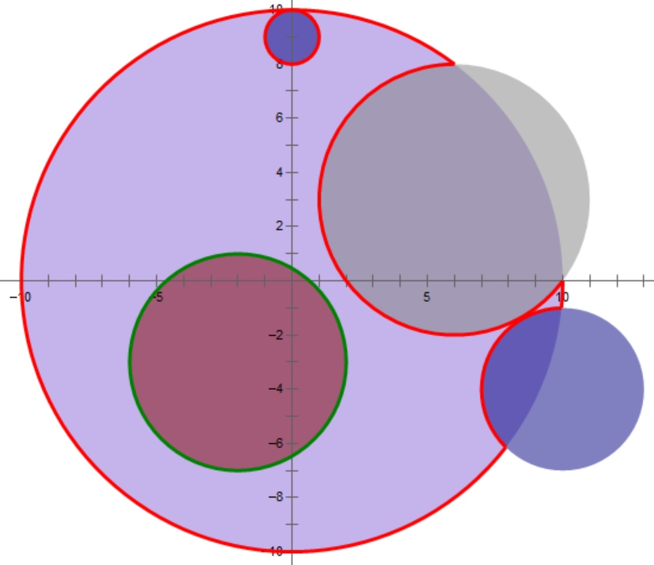
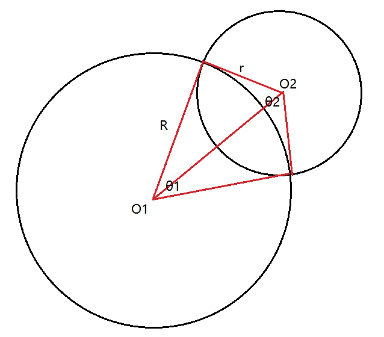

* [Multi-University contest 5](http://acm.hdu.edu.cn/userloginex.php?cid=806)

## 1002. Beautiful Now（暴力 + 剪枝）
* **题目大意** ： 给定数字，每次交换2位数（可以同位），求k次交换后最大值和最小值。
* **大体思路** ： （贪心wa到哭，逐位与取后面的最后一个最大值/最小值交换的 **贪心是错的**，反例如`970979`交换2次，贪心最大值是`999077`，答案为`999770`）由于数字最多只有9位，故想到全排列下标 **暴力枚举** 一下，每次判断是否可以通过小于等于k次交换到，若可以则更新最大值和最小值。易知 **逐位交换** （类似于 **选择排序** ）所需的交换次数为`len - 1`，其中len表示位数，对于每个分块都求一遍最后求和即可得到总的交换次数。
```c++
#include<bits/stdc++.h>

using namespace std;

string s;
int id[10], res1, res2;
int len, k, ct, num;
bool book[10];

bool check() {

    memset(book, 0, sizeof(book));
    int res = 0;
    for (int i = 0, ct; i < len; i++) {
        if (book[i]) continue;
        for (ct = 0; !book[i]; i = id[i]) book[i] = true, ct++;
        res += ct - 1;
        if (res > k) return false;
    }
    return true;
}
void solve() {

    cin >> s >> k;
    len = s.length();
    num = atoi(s.c_str());
    for (int i = 0; i < len; i++) id[i] = i;
    res1 = res2 = num;
    do {
        if (s[id[0]] != '0' and check()) {
            num = 0;
            for (int i = 0; i < len; i++) num = num * 10 + s[id[i]] - '0';
            res1 = min(res1, num);
            res2 = max(res2, num);
        }
    } while (next_permutation(id, id + len));
    cout << res1 << ' ' << res2 << endl;
}
int main() {

    ios::sync_with_stdio(false), cin.tie(nullptr), cout.tie(nullptr);
    cin >> ct;
    while (ct--) solve();

    return 0;
}
```

## 1005. Everything Has Changed （平面几何 / 解析几何）
* **题目大意** ： 给定圆心位于圆点的大园，和若干不内含大圆且互不相交的小圆，求大圆与校园相交的如下红色弧的长度。



* **大体思路** ： 所求弧长即为大圆周长减去大圆每个被小圆涵盖的弧长再加上每个小圆被大圆涵盖的弧长，其中2圆必须相交或相切。可以从 **平面几何** 和 **解析几何** 两个方向解题，但是后者计算量太大故只推荐前者。针对2圆构造如下 **辅助线** ：



* 易知对于相交两圆答案更新值为`res += θ2 * r - θ1 * R `，只要求到两个 **圆心角** 即可。根据 **余弦定理** 得到`cos(θ1 / 2) = (R^2 + o1o2^2 - r^2) / (2 * R * o1o2)`，同理`cos(θ2 / 2) = (r^2 + o1o2^2 - R^2) / (2 * r * o1o2)`，再利用 **反余弦函数** 即可求到2个 **圆心角** 。每次判断是否相交或相切，更新答案即可。

```c++
#include<bits/stdc++.h>

using namespace std;

const double pi = acos(-1);
int n, m, ct, x, y, r;

inline double hypot2 (double x, double y) {
    return x * x + y * y;
}
void solve() {

    cin >> n >> m;
    double res = 2 * pi * m, s1, s2;
    while (n--) {
        cin >> x >> y >> r;
        if (hypot(x, y) < m - r or hypot(x, y) > m + r) continue;
        s1 = 2 * acos((m * m + hypot2(x, y) - r * r) / (2 * m * hypot(x, y)));
        s2 = 2 * acos((r * r + hypot2(x, y) - m * m) / (2 * r * hypot(x, y)));
        res += r * s2 - m * s1;
    }
    printf("%.8f\n", res);
}
int main() {

    cin >> ct;
    while (ct--) solve();

    return 0;
}
```

## 1007. Glad You Came （线段树）
（占坑）

## 1008. Hills And Valleys （dp）
（占坑）

