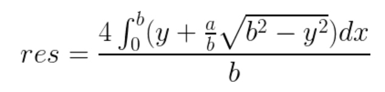

* [Multi-University contest 6](http://acm.hdu.edu.cn/userloginex.php?cid=807)

## 1001. oval-and-rectangle （期望 + 微积分）
* **题目大意** ： 给定椭圆标准方程中的a和b，求有一个边坐标为`y = c`的椭圆的 **内接矩形** 周长期望。
* **大体思路** ： 考虑第一象限中`x = a * sqrt(1 - y^2 / b^2)`，从而 **定积分** 式子如下，化简一下得到`res = 2 * b + a * π`



```c++
#include<bits/stdc++.h>

using namespace std;

const double pi = acos(-1);
const int t = 1000000;
int ct, a, b;

int main() {

    cin >> ct;
    while (ct--) {
        cin >> a >> b;
        printf("%.6f\n", floor((2 * b + a * pi) * t) / t);
    }

    return 0;
}
```

## 1002. bookshelf

## 1009. Werewolf

## 1012. Pinball （物理）
* **题目大意** ： 给定斜面和小球坐标，求小球掉落到地面之前与斜面碰撞次数。
* **大体思路** ： 设斜面夹角为θ。考虑 **正交分解** ，小球与斜面碰撞的瞬间只受重力加速度，分解为平行斜面向下的加速度`gsin(θ)`与垂直斜面向上的加速度`gcos(θ)`。由于不受外力且无能量损耗，故可以视为从碰撞一瞬间起，小球在平行斜面方向上作 **匀加速直线运动**，在垂直斜面方向上作 **自由上抛运动** 和 **自由落体运动** ，且每次弹跳高度与时间间隔都一样。故只需求出第一次碰撞的初速度和每次弹跳的时间间隔即可，利用 **动能定理** 得到平行斜面 **初速度** `v0 = sqrt(2 * g * (y + x / a * b)) * sin(θ)`；第一次下落 **时间间隔** 为`t = sqrt(2 * (y + x / a * b) / g)`，则之后每次间隔时间为一次上抛和一次落体的时间2t。每次更新 **到原点的距离** 和 **沿斜面的速度** 即可。
```c++
#include <bits/stdc++.h>

using namespace std;

const double g = 9.8;
double a, b, x, y, res;
int ct;

void solve() {

    res = 0;
    cin >> a >> b >> x >> y;
    double dis = sqrt(pow(x / a * b, 2) + x * x), t = sqrt(2 * (y + x / a * b) / g);
    double sin = b / hypot(a, b), v = g * sin * t;
    while (dis > 0) {
        dis -= v * 2 * t + g * sin * 2 * t * t;
        v += 2 * g * sin * t;
        res++;
    }
    cout << res << endl;
}
int main() {

    cin >> ct;
    while (ct--) solve();

    return 0;
}
```


