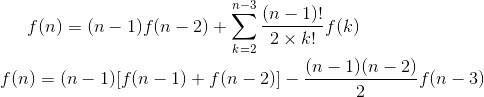
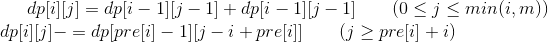
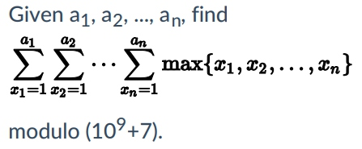
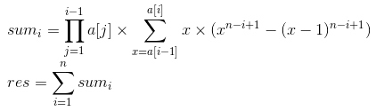

* [nowcoder contest 1](https://www.nowcoder.com/acm/contest/139/#question)
* [nowcoder contest 2](https://www.nowcoder.com/acm/contest/140#question)
## 1_A. Monotonic Matrix （LGV + DP + 组合数学）
* **题目大意** ： 给定n, m表示n×m的矩阵，所有点只能填`0, 1, 2`且每个点的数值小于等于右边及下面的数值，求方案数对(1e9 + 7)取模。
* **大体思路** ： 填充方案数实际就是01和12分界线的方案数，即从`(n, 0)`到`(0, m)`的两条可重合但不相交的分界线方案数。可进一步转换为从`(n, 0)`到`(0, m)`和从`(n - 1, -1)`到`(-1, m - 1)`的两条严格不相交的路径。利用[LGV算法](https://en.wikipedia.org/wiki/Lindstr%C3%B6m%E2%80%93Gessel%E2%80%93Viennot_lemma)得到答案。组合数利用 **杨辉三角** 打表即可。 （矩阵规格是`n*m`的但路径规格是`(n+1)*(m+1)`，一开始连这个都看错了噗）


```c++
#include <bits/stdc++.h>

using namespace std;
typedef long long LL;

const int maxn = 2005;
const int mod = int(1e9 + 7);
LL c[maxn][maxn];
int n, m;

void ini() {

    for (int n = 0; n < maxn; n++) {
        c[n][0] = c[n][n] = 1;
        for (int i = 1; i < n; i++)
            c[n][i] = (c[n - 1][i] + c[n - 1][i - 1]) % mod;
    }
}
int main() {

    ios::sync_with_stdio(false), cin.tie(nullptr), cout.tie(nullptr);
    ini();
    while (cin >> n >> m) {
        cout << (c[n + m][n] * c[n + m][n] % mod - c[n + m][n - 1] * c[n + m][m - 1] % mod + mod) % mod << endl;
    }

    return 0;
}
```

* 类似题目：[codeforces 348D](https://codeforces.com/contest/348/problem/D)，问在有障碍图中从左上到右下的两条不同路线的方案数。[代码](https://github.com/KingJoySaiy/Iterator/blob/master/%E5%A4%9A%E6%A0%A1%E8%AE%AD%E7%BB%83/2018%20Nowcoder%20Contest%201/_image/cf_948d.cpp)

## 1_B. Symmetric Matrix （DP + 组合数学）
* **题目大意** ： 在n阶方阵中每行和必须为2，数字只能是`0, 1, 2`求方阵的方案数。
* **大体思路** ： 题意可以转换为有n个节点的无向图，所有节点的度为2，允许有重边但不能有自环，求满足条件的图的个数。考虑用求 **动态规划** 的递推式，`dp[n]`表示前n个节点构成的图的方案数。可以从前`n - 1`个节点任选一个出来与新节点构图这两个节点间有2个重边，则节点的度都为2满足条件，得出`dp[n] = (n - 1) * dp[n - 2]`。再扩展到一般情况，保留前`n - 1`个节点中k个节点的边，剩余的`n - 1 - k`个节点按照任意排列与新节点构成新的邻接矩阵，再加上上述特殊情况，得到如下递推式：



为消去sigma符号，可以利用`f[n] - (n - 1) * f[n - 1]`错位相减即可得到第二个式子。
(数据范围n的总和不超过`1e7`，所以针对每组输入直接递推输出第n项即可。本来想进一步简化求出 **通项公式** 或用 **矩阵快速幂** 的，能力有限没搞出来=_=)

```c++
#include <bits/stdc++.h>

using namespace std;
typedef long long LL;

const int maxn = int(1e5 + 5);
LL f[maxn], n, mod;

void solve() {

    f[0] = f[1] = 0ll % mod;
    f[2] = f[3] = 1ll % mod;
    for (LL i = 4ll; i <= n; i++) {
        f[i] = ((i - 1) * f[i - 1] % mod
                + (i - 1) * f[i - 2] % mod
                - (i - 1) * (i - 2) / 2 % mod * f[i - 3] % mod
                + mod) % mod;
    }
    cout << f[n] << endl;
}
int main() {

    ios::sync_with_stdio(false), cin.tie(nullptr), cout.tie(nullptr);
    while (cin >> n >> mod) solve();

    return 0;
}
/*
f(x) = (n - 1) * [f(n - 1) + f(n - 2)] - (n - 1) * (n - 2) / 2 * f(n - 3)
value: 0, 0, 1, 1, 6, 22 ...
index: 0, 1, 2, 3, 4, 5  ...
 */
```

## 1_D. Two Graphs (枚举 + 图论）
* **题目大意** ： 给定2个最多8个节点的无向图，两个图都有n个节点且无重边。求从图2中选出多少种映射方案使之与图1同构。
* **大体思路** ： 用`1-n`的全排列枚举`n!`种映射方案，若保证是双射 （ 即图1中i-j的边x都对应图2中某边f(x) ） ，则将`pair(i, j)`塞进set中去重。实践证明可以将二维邻接矩阵下标(i, j)转换为一维(i * n + j)以实现去重，不会爆64位int。
```c++
#include <bits/stdc++.h>

using namespace std;
typedef long long LL;

const int maxn = 10;
bool a[maxn][maxn], b[maxn][maxn];
unordered_set<LL> all;
int f[maxn];
int n, m1, m2, x, y;

void solve() {

    memset(a, false, sizeof(a));
    memset(b, false, sizeof(b));
    for (int i = 0; i < n; i++) f[i] = i;
    all.clear();

    while (m1--) {
        cin >> x >> y; x--, y--;
        a[x][y] = a[y][x] = true;
    }
    while (m2--) {
        cin >> x >> y; x--, y--;
        b[x][y] = b[y][x] = true;
    }
    do {
        LL t = 0ll;
        for (int i = 0; i < n; i++) {
            for (int j = 0; j < n; j++) {
                if (!a[i][j]) continue;
                if (b[x = f[i]][y = f[j]]) {
                    if (x > y) swap(x, y);
                    t |= LL(1) << (x * n + y);
                } else goto ed;
            }
        }
        all.insert(t);
        ed: continue;
    } while (next_permutation(f, f + n));
    cout << all.size() << endl;
}
int main() {

    ios::sync_with_stdio(false), cin.tie(nullptr), cout.tie(nullptr);
    while (cin >> n >> m1 >> m2) solve();

    return 0;
}
```
## 1_E. Removal （DP）
* **题目大意** ： 给定长度为n的序列，问删去m个数后有多少种不同序列。
* **大体思路** ： 典型DP题，考虑`dp[i][j]`为前i个数中删去j个数后的不同序列数，显然`0 ≤ j ≤ min(i, m)`。若序列中无重复数字则`dp[i][j] = dp[i - 1][j - 1] + dp[i - 1][j]`表示第i个数删和不删2种情况。先现考虑有重复的序列，例如`12343`这个序列`dp[3][0]`和`dp[5][2]`种都有`123`这个序列，则可看出若删数个数j大于a[i]距上一个等于a[i]的长度则可出现这种重复情况，所以需要`dp[5][2] -= dp[2][0]`，表示删除前2个数已选好，第3个数因为重复必须要删除。综上所述，递推式为：



其中`pre[i]`表示上一个等于`a[i]`的数的下标(如果存在的话)。

```c++
#include <bits/stdc++.h>

using namespace std;
typedef long long LL;

const int mod = int(1e9 + 7);
const int maxn = int(1e5 + 5);

int a[maxn], pre[maxn], las[maxn];
LL dp[maxn][15];
int n, m, k;

void solve() {

    memset(pre, 0, sizeof(pre));
    memset(las, 0, sizeof(las));
    memset(dp, 0, sizeof(dp));
    for (int i = 1; i <= n; i++) {
        cin >> a[i];
        pre[i] = las[a[i]];
        las[a[i]] = i;
        dp[i][0] = 1;
    }

    for (int i = dp[0][0] = 1; i <= n; i++) {
        for (int j = 0; j <= min(i, m); j++) {
            (dp[i][j] = dp[i - 1][j - 1] + dp[i - 1][j]) %= mod;
            if (pre[i] and pre[i] + j >= i) {
                (dp[i][j] -= dp[pre[i] - 1][pre[i] + j - i] - mod) %= mod;
            }
        }
    }
    cout << dp[n][m] << endl;
}
int main() {

    ios::sync_with_stdio(false), cin.tie(nullptr), cout.tie(nullptr);
    while (cin >> n >> m >> k) solve();

    return 0;
}
```
## 1_F. Sum of Maximum （拉格朗日插值 + 逆元 + 快速幂 + 容斥原理 + 伯努利数）
* **题目大意** ： 如下图



* **大体思路** ： 由于a的顺序对结果没有影响，所以a按升序排序，两两之间计算。只需`x∈{a[i - 1], a[i]}`对答案的贡献，推导过程好长不写了 （ 其实还没有完全学会 ）， 直接上答案。因为`a[i] ≤ 1e9`比较大，所以求该处的n次多项式用常规地推办法必然超时，用 **拉格朗日插值定理** 即可求出任意一点的函数值。



```c++
#include<bits/stdc++.h>

using namespace std;
typedef long long LL;

const int mod = int(1e9 + 7);
const int maxn = 1020;

LL b[maxn][maxn], c[maxn][maxn];
LL a[maxn], d[2][maxn];
LL n, k, res;

LL mod_pow(LL x, LL n) {

    LL res = 1;
    while (n) {
        if (n & 1) res = res * x % mod;
        x = x * x % mod;
        n >>= 1;
    }
    return res;
}
LL cal(LL n, LL k) {

    if (n <= 0) return 0;
    if (n <= k + 1) return c[k][n];
    LL res = 0;
    d[0][0] = d[1][k + 1] = 1;      //d[0][i] -> (0 ~ i)前缀积, d[1][i] -> (k + 1 ~ i)后缀积
    for (LL i = 1; i <= k + 1; i++) d[0][i] = d[0][i - 1] * (n - i + 1) % mod;
    for (LL i = k; i >= 0; i--) d[1][i] = d[1][i + 1] * (n - i - 1) % mod;
    for (LL i = 0; i <= k + 1; i++) {
        (res += (d[0][i] * d[1][i] % mod) * (b[k][i] * c[k][i] % mod) % mod) %= mod;
    }
    return res;
}
void ini() {

    for (int i = 1; i <= 1005; i++) {
        c[i][0] = 0;
        for (int j = 1; j <= i + 1; j++)
            c[i][j] = (c[i][j - 1] + mod_pow(j, i)) % mod;  //c[i] -> j ^ (1 ~ i) 前缀和

        for (int j = 0; j <= i; j++) {
            if (i == 1) {
                b[i][0] = mod_pow(2, mod - 2);
                b[i][1] = mod_pow(-1, mod - 2);
            } else {
                b[i][j] = b[i - 1][j] * mod_pow(j - (i + 1), mod - 2) % mod;
            }
        }
        b[i][i + 1] = 1;
        for (int j = 0; j <= i; j++) b[i][i + 1] = b[i][i + 1] * (i + 1 - j) % mod;
        b[i][i + 1] = mod_pow(b[i][i + 1], mod - 2);     //b[i] -> mod下 (-1 ~ i + 1) 前缀积的逆元
    }
}
void solve() {

    for (int i = 1; i <= n; i++) cin >> a[i];
    sort(a + 1, a + 1 + n);
    a[0] = res = 0;
    LL vv = 1;
    for (int i = 1; i <= n; i++) {
        k = n - i + 1;      //从大到小分段计算
        LL vv2 = (mod_pow(a[i], k + 1) - mod_pow(a[i - 1], k + 1) - cal(a[i] - 1, k) + cal(a[i - 1] - 1, k)) % mod;
        (res += vv * vv2 % mod) %= mod;
        (vv *= a[i]) %= mod;
    }
    while (res < 0) res += mod;
    cout << res << endl;
}
int main() {
    
    ios::sync_with_stdio(false), cin.tie(nullptr), cout.tie(nullptr);
    ini();
    while (cin >> n) solve();

    return 0;
}
```

## 2_A. run （DP）
* **题目大意** ： 给定k，从0开始每次往前走1步或者跳k步，但不能连跳2次。对于q个查询`[l, r]`求抵达该区间内所有点的方案总和。
* **大体思路** ： 考虑`dp1[i]`记录走到位置i的方案数，`dp2[i]`记录跳到位置i的方案数。不难看出前者的状态转移方程为`dp1[i] = dp1[i - 1] + dp2[i - 1]`，表示可以走到`i - 1`再走到i或跳到`i - 1`再走到i； 后者是`dp2[i] = dp1[i - k]`，表示从`i - k`跳到i必须满足之前是走到`i - k`的。
 
```c++
#include <bits/stdc++.h>

using namespace std;

const int mod = int(1e9 + 7);
const int maxn = int(1e5 + 5);

long long res[maxn], dp[maxn];
int q, k, l, r;

int main() {

    ios::sync_with_stdio(false), cin.tie(nullptr), cout.tie(nullptr);
    cin >> q >> k;
    for (int i = 0; i < k; i++) res[i] = 1;
    for (int i = k; i < maxn; i++) {
        res[i] = res[i - 1] + dp[i - 1] % mod;
        dp[i] = res[i - k];
    }
    res[0] = dp[0] = 0;
    for (int i = 1; i < maxn; i++) {
        (res[i] += res[i - 1] + dp[i]) %= mod;
    }

    while (q--) {
        cin >> l >> r;
        cout << (res[r] - res[l - 1] + mod) % mod << endl;
    }

    return 0;
}
```

## 2_C. message （凸包 + 三分）
* **题目大意** ： 坐标系内有n条直线`y = a * x + b`，ab都给出。对于m次查询`y = c * x + d`，求直线与上述直线集合交点的大于0的横坐标最大值。
* **大体思路** ： 这题很考验思维啊，两直线交点横坐标为`(d - b) / (a - c)`，要求大于0的横坐标最大值即为求`(a, b), (c, d)`两点构成直线斜率相反数最大值，亦即斜率小于0的最小值。然后对于`(a, b)`点集用凸包维护，对于每个`(c, d)`可以在凸包中 **三分** 斜率最小值，由于三分的是 **离散型** 的索引值，所以不是比较三等分点而是比较`cost[mid]`和`cost[mid + 1]`，然后让`left`和`right`向中间聚拢即可。

```c++
#include <bits/stdc++.h>

using namespace std;

const int maxn = int(1e5 + 5);
int n, m;

struct data {

    double x, y, res;
    int id;
    bool operator < (data t) {
        return x < t.x or x == t.x and y < t.y;
    }
    double K(data t) {
        return (y - t.y) / (x - t.x);
    }
    double cross(data a,data b) {    //t->a cross t->b
        return (a.x - x) * (b.y - y) - (a.y - y) * (b.x - x);
    }
} a[maxn], s[maxn];

inline bool cmp(data a, data b) {

    return a.id < b.id;
}
void graham() {

    for (int i = 0, top = 0; i < m; i++) {
        if (!a[i].id) {      //id -> 0 ~ n - 1，加入凸包
            while (top > 1 and s[top - 2].cross(a[i], s[top - 1]) <= 0) top--;
            s[top++] = a[i];
        } else {              //id -> n ~ m - 1，在凸包中三分斜率最小值
            if (!top) continue;
            int l = 0, r = top - 1, m;
            while (l < r) {
                m = (l + r) / 2;
                if (a[i].K(s[m]) < a[i].K(s[m + 1])) r = m;
                else l = m + 1;
            }
            a[i].res = min(a[i].res, a[i].K(s[l]));
        }
    }
}
int main() {

    cin >> n;
    for (int i = 0; i < n; i++) scanf("%lf%lf", &a[i].x, &a[i].y);
    cin >> m;
    m += n;
    for (int i = n; i < m; i++)
        scanf("%lf%lf", &a[i].x, &a[i].y), a[i].id = i;

    sort(a, a + m);
    graham();
    reverse(a, a + m);
    graham();
    sort(a, a + m, cmp);

    for (int i = n; i < m; i++) {
        if (a[i].res < 0) printf("%.12f\n", -1 * a[i].res);
        else puts("No cross");
    }

    return 0;
}
```

## 2_D. money （模拟）
* **题目大意** ： 给定n个数，从左往右可以花a[i]物品+1，可以物品-1获得a[i]，也可跳过。求最最大利润和最小操作次数。
* **大体思路** ： 从左往右扫一遍，极小值就买，极大值就卖。

```c++
#include <bits/stdc++.h>

using namespace std;

const int maxn = int(1e5 + 5);

int a[maxn], n, ct;

void solve() {

    long long res = 0, ct = 0;
    cin >> n;
    for (int i = 0; i < n; i++) cin >> a[i];

    bool flag = true;
    int mi, t = 0;
    while (true) {
        if (flag) {
            while (t < n - 1 and a[t] >= a[t + 1]) t++;
            mi = a[t];
        } else {
            while (t < n - 1 and a[t] <= a[t + 1]) t++;
            res += a[t] - mi;
            ct++;
        }
        flag = !flag;
        if (t == n - 1) break;
    }
    cout << res << ' ' << 2 * ct << endl;
}
int main() {

    ios::sync_with_stdio(false), cin.tie(nullptr), cout.tie(nullptr);
    cin >> ct;
    while (ct--) solve();

    return 0;
}
```

## 2_G. transform （二分 + 尺取法）
* **题目大意** ：坐标轴上有若干箱子，每个箱子里有若干个货物，移动1个货物的费用是距离差的绝对值。问在最大花费为T，最多能集中到一起的货物数量。
* **大体思路** ：维护前i个货物的数量前缀和`ct[i]`，把前i个货物移动到坐标原点的花费`cost[i]`，每个箱子的位置为`dis[i]`。易知将`[l, r]`所有货物全部移动到l的花费为`costL = cost[r] - cost[l - 1] - dis[l] * (ct[r] - ct[l - 1])`，表示把区间所有货物移到坐标0，再减去移多的长度`dis[l]`。而将`[l, r]`所有货物移动到r的花费为`costR = (ct[r] - ct[l - 1]) * (dis[r] - dis[l - 1]) - costL(l, r)`，表示把区间内的所有货物整体向右移动`(r - l)`，从而区间变为`[r, 2 * r - l]`，再根据上式全部移动到区间最左端r即可。答案货物数量一定是升序的，可以二分答案。一个贪心的思想是将某区间`[l, r]`的货物尽量移动到其 **中位数** 附近，对于每个二人枚举的答案，利用 **尺取法** （或称 **滑窗** ）得到满足条件的区间`[l, r]`，实际上只从左往右滑窗不一定能滑到最右端，所以需要2次滑窗。再利用上述2个式子判断`[l, mid]`的货物移到`mid`和`[mid, r]`的货物移到`mid`的花费总和是否小于T即可，其中`mid`表示区间的中位数。实现起来有很多细节问题，比较难处理。

```c++
#include <bits/stdc++.h>

using namespace std;
typedef long long LL;

const int maxn = int(5e5 + 5);
LL dis[maxn], ct[maxn], cost[maxn], all, n;

LL costL(LL l, LL r) {

    return cost[r] - cost[l - 1] - dis[l] * (ct[r] - ct[l - 1]);
}
LL costR(LL l, LL r) {

    return (ct[r] - ct[l - 1]) * (dis[r] - dis[l]) - costL(l, r);
}
bool check(LL x) {

    LL l, r, m, mid = x / 2 + 1;     //中位数
    l = r = m = 1;
    while (true) {
        while (r <= n and ct[r] - ct[l - 1] < x) r++;
        while (m <= n and ct[m] - ct[l - 1] < mid) m++;
        if (r > n or m > r) break;
        if (costR(l, m) + costL(m, r) - (dis[r] - dis[m]) * (ct[r] - ct[l - 1] - x) <= all) return true;
        l++;
    }
    l = r = m = n;
    while (true) {
        while (l >= 1 and ct[r] - ct[l - 1] < x) l--;
        while (m >= 2 and ct[r] - ct[m - 1] < mid) m--;
        if (l < 1 or m < l) break;
        if (costR(l, m) + costL(m, r) - (dis[m] - dis[l]) * (ct[r] - ct[l - 1] - x) <= all) return true;
        r--;
    }
    return false;
}

int main() {

    ios::sync_with_stdio(false), cin.tie(nullptr), cout.tie(nullptr);
    cin >> n >> all, all /= 2;
    for (int i = 1; i <= n; i++) cin >> dis[i];
    for (int i = 1; i <= n; i++) {
        cin >> ct[i];
        cost[i] = cost[i - 1] + dis[i] * ct[i];
        ct[i] += ct[i - 1];
    }
    LL l = -1, r = ct[n] + 1, m;
    while (r - l > 1) {
        m = (l + r) / 2;
        if (check(m)) l = m;
        else r = m;
    }
    cout << l << endl;

    return 0;
}
```

## 2_I. car （模拟）

* **题目大意** ：在n*n的方格中右m个障碍，从角落放车以相同速度行驶（中途不能相撞），问最多能放的小车数目。
* **大体思路** ：先考虑没有障碍，为了让小车不相撞，四条边上分别放`n / 2`辆车，这样最多能放`2 * n`辆，但是n为奇数时在`2 / n`行或列上放2辆速度相同的车会导致相撞，故只能放1辆，从而答案为`res = 2 * n - n % 2`。如果有障碍，则用2个长度为n的布尔数组标记一下即可。

```c++
#include <bits/stdc++.h>

using namespace std;

const int maxn = int(1e5 + 5);
int a[maxn], b[maxn];
int n, m, x, y;

int main() {

    ios::sync_with_stdio(false), cin.tie(nullptr), cout.tie(nullptr);
    cin >> n >> m;
    while (m--) {
        cin >> x >> y;
        a[x - 1] = b[y - 1] = true;
    }

    int res = 2 * n;
    for (int i = 0; i < n; i++) res -= a[i] + b[i];
    if (n % 2 and !a[n / 2] and !b[n / 2]) res--;
    cout << res << endl;

    return 0;
}
```

## 2_J. farm （随机化 / 二维线段树 / 大模拟）

* **题目大意** ：给定n*m个数，t次修改把`(x1, y1)(x2, y2)`为对角线的矩阵内所有数改为k，问最后与初始数不同的个数。
* **大体思路** ：大致三种解题思路 **随机化** , **二维线段树** , **大模拟**。第三者更容易理解和实现，每个数最大`1e6`所以分别维护每个数前21位的 **矩阵前缀和** ，问题转换成01问题，数字不改变当且仅当所有二进制位都不改变。根据矩阵前缀和可以快速求出`(i, j)`位置处第ct位0或1变化次数，若有一个改变则该位置的数字坏掉。开一个布尔数组标记，最后坏掉的数求和一下即可。
```c++
#include <iostream>
#include <cstring>

using namespace std;

const int maxn = int(2e6 + 5);
int a[maxn], num[2][maxn];
int x1[maxn], y1[maxn], x2[maxn], y2[maxn], k[maxn];
bool bad[maxn];
int n, m, t, res;

bool find(int x, int ct) {  //x二进制下从右往左第ct位

    while (--ct) x >>= 1;
    return bool(x % 2);
}
void work() {

    for (int ct = 1, id; ct < 22; ct++) {   //1e6维护二进制下21位即可
        memset(num, 0, sizeof(num));
        for (int i = 0; i < t; i++) {       //更新前缀和
            id = find(k[i], ct);
            num[id][(x2[i] + 1) * m + y2[i] + 1]++;
            num[id][x1[i] * m + y1[i]]++;
            num[id][(x2[i] + 1) * m + y1[i]]--;
            num[id][x1[i] * m + y2[i] + 1]--;
        }
        for (int i = 1; i <= n; i++) {
            for (int j = 1; j <= m; j++) {
                int _0 = 0, _1 = 0;
                find(a[i * m + j], ct) ? (_1++) : (_0++);   //第ct位0和1出现个数
                num[0][i * m + j] += num[0][(i - 1) * m + j] + num[0][i * m + j - 1] - num[0][(i - 1) * m + j - 1];
                num[1][i * m + j] += num[1][(i - 1) * m + j] + num[1][i * m + j - 1] - num[1][(i - 1) * m + j - 1];
                _0 += num[0][i * m + j], _1 += num[1][i * m + j];
                bad[i * m + j] |= (_0 > 0 and _1 > 0);      //0或1有一个改变则坏掉
            }
        }
    }
}
int main() {

    ios::sync_with_stdio(false), cin.tie(nullptr), cout.tie(nullptr);
    cin >> n >> m >> t;
    for (int i = 1; i <= n; i++)
        for (int j = 1; j <= m; j++) cin >> a[i * m + j];

    for (int i = 0; i < t; i++)
        cin >> x1[i] >> y1[i] >> x2[i] >> y2[i] >> k[i];

    work();
    for (int i = 0; i < maxn; i++) res += bad[i];
    cout << res << endl;

    return 0;
}
```