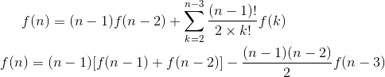
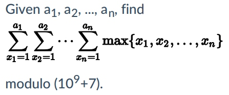
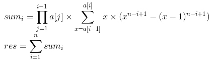

* [nowcoder contest 1](https://www.nowcoder.com/acm/contest/139/#question)
## A. Monotonic Matrix （LGV + DP + 组合数学）
* **题目大意** ： 给定n, m表示n×m的矩阵，所有点只能填`0, 1, 2`且每个点的数值小于等于右边及下面的数值，求方案数对(1e9 + 7)取模。
* **大体思路** ： 填充方案数实际就是01和12分界线的方案数，即从`(n, 0)`到`(0, m)`的两条可重合但不相交的分界线方案数。可进一步转换为从`(n, 0)`到`(0, m)`和从`(n - 1, -1)`到`(-1, m - 1)`的两条严格不相交的路径。利用[LGV算法](https://en.wikipedia.org/wiki/Lindstr%C3%B6m%E2%80%93Gessel%E2%80%93Viennot_lemma)得到答案。组合数利用 **杨辉三角** 打表即可。 （矩阵规格是`n*m`的但路径规格是`(n+1)*(m+1)`，一开始连这个都看错了噗）


```c++
#include <bits/stdc++.h>

using namespace std;
typedef long long LL;

const int maxn = 2005;
const int mod = int(1e9 + 7);
LL c[maxn][maxn];
int n, m;

void ini() {

    for (int n = 0; n < maxn; n++) {
        c[n][0] = c[n][n] = 1;
        for (int i = 1; i < n; i++)
            c[n][i] = (c[n - 1][i] + c[n - 1][i - 1]) % mod;
    }
}
int main() {

    ios::sync_with_stdio(false), cin.tie(nullptr), cout.tie(nullptr);
    ini();
    while (cin >> n >> m) {
        cout << (c[n + m][n] * c[n + m][n] % mod - c[n + m][n - 1] * c[n + m][m - 1] % mod + mod) % mod << endl;
    }

    return 0;
}
```

* 类似题目：[codeforces 348D](https://codeforces.com/contest/348/problem/D)，问在有障碍图中从左上到右下的两条不同路线的方案数。[代码](https://github.com/KingJoySaiy/Iterator/blob/master/%E5%A4%9A%E6%A0%A1%E8%AE%AD%E7%BB%83/2018%20Nowcoder%20Contest%201/code/cf_948d.cpp)

## B. Symmetric Matrix （DP + 组合数学）
* **题目大意** ： 在n阶方阵中每行和必须为2，数字只能是`0, 1, 2`求方阵的方案数。
* **大体思路** ： 题意可以转换为有n个节点的无向图，所有节点的度为2，允许有重边但不能有自环，求满足条件的图的个数。考虑用求 **动态规划** 的递推式，`dp[n]`表示前n个节点构成的图的方案数。可以从前`n - 1`个节点任选一个出来与新节点构图这两个节点间有2个重边，则节点的度都为2满足条件，得出`dp[n] = (n - 1) * dp[n - 2]`。再扩展到一般情况，保留前`n - 1`个节点中k个节点的边，剩余的`n - 1 - k`个节点按照任意排列与新节点构成新的邻接矩阵，再加上上述特殊情况，得到如下递推式：



为消去sigma符号，可以利用`f[n] - (n - 1) * f[n - 1]`错位相减即可得到第二个式子。
(数据范围n的总和不超过`1e7`，所以针对每组输入直接递推输出第n项即可。本来想进一步简化求出 **通项公式** 或用 **矩阵快速幂** 的，能力有限没搞出来=_=)

```c++
#include <bits/stdc++.h>

using namespace std;
typedef long long LL;

const int maxn = int(1e5 + 5);
LL f[maxn], n, mod;

void solve() {

    f[0] = f[1] = 0ll % mod;
    f[2] = f[3] = 1ll % mod;
    for (LL i = 4ll; i <= n; i++) {
        f[i] = ((i - 1) * f[i - 1] % mod
                + (i - 1) * f[i - 2] % mod
                - (i - 1) * (i - 2) / 2 % mod * f[i - 3] % mod
                + mod) % mod;
    }
    cout << f[n] << endl;
}
int main() {

    ios::sync_with_stdio(false), cin.tie(nullptr), cout.tie(nullptr);
    while (cin >> n >> mod) solve();

    return 0;
}
/*
f(x) = (n - 1) * [f(n - 1) + f(n - 2)] - (n - 1) * (n - 2) / 2 * f(n - 3)
value: 0, 0, 1, 1, 6, 22 ...
index: 0, 1, 2, 3, 4, 5  ...
 */
```

## D. Two Graphs (枚举 + 图论）
* **题目大意** ： 给定2个最多8个节点的无向图，两个图都有n个节点且无重边。求从图2中选出多少种映射方案使之与图1同构。
* **大体思路** ： 用`1-n`的全排列枚举`n!`种映射方案，若保证是双射 （ 即图1中i-j的边x都对应图2中某边f(x) ） ，则将`pair(i, j)`塞进set中去重。实践证明可以将二维邻接矩阵下标(i, j)转换为一维(i * n + j)以实现去重，不会爆64位int。
```c++
#include <bits/stdc++.h>

using namespace std;
typedef long long LL;

const int maxn = 10;
bool a[maxn][maxn], b[maxn][maxn];
unordered_set<LL> all;
int f[maxn];
int n, m1, m2, x, y;

void solve() {

    memset(a, false, sizeof(a));
    memset(b, false, sizeof(b));
    for (int i = 0; i < n; i++) f[i] = i;
    all.clear();

    while (m1--) {
        cin >> x >> y; x--, y--;
        a[x][y] = a[y][x] = true;
    }
    while (m2--) {
        cin >> x >> y; x--, y--;
        b[x][y] = b[y][x] = true;
    }
    do {
        LL t = 0ll;
        for (int i = 0; i < n; i++) {
            for (int j = 0; j < n; j++) {
                if (!a[i][j]) continue;
                if (b[x = f[i]][y = f[j]]) {
                    if (x > y) swap(x, y);
                    t |= LL(1) << (x * n + y);
                } else goto ed;
            }
        }
        all.insert(t);
        ed: continue;
    } while (next_permutation(f, f + n));
    cout << all.size() << endl;
}
int main() {

    ios::sync_with_stdio(false), cin.tie(nullptr), cout.tie(nullptr);
    while (cin >> n >> m1 >> m2) solve();

    return 0;
}
```
## E. Removal （DP）
* **题目大意** ： 给定长度为n的序列，问删去m个数后有多少种不同序列。
* **大体思路** ： 典型DP题，考虑`dp[i][j]`为前i个数中删去j个数后的不同序列数，显然`0 ≤ j ≤ min(i, m)`。若序列中无重复数字则`dp[i][j] = dp[i - 1][j - 1] + dp[i - 1][j]`表示第i个数删和不删2种情况。先现考虑有重复的序列，例如`12343`这个序列`dp[3][0]`和`dp[5][2]`种都有`123`这个序列，则可看出若删数个数j大于a[i]距上一个等于a[i]的长度则可出现这种重复情况，所以需要`dp[5][2] -= dp[2][0]`，表示删除前2个数已选好，第3个数因为重复必须要删除。综上所述，递推式为：


其中`pre[i]`表示上一个等于`a[i]`的数的下标(如果存在的话)。

```c++
#include <bits/stdc++.h>

using namespace std;
typedef long long LL;

const int mod = int(1e9 + 7);
const int maxn = int(1e5 + 5);

int a[maxn], pre[maxn], las[maxn];
LL dp[maxn][15];
int n, m, k;

void solve() {

    memset(pre, 0, sizeof(pre));
    memset(las, 0, sizeof(las));
    memset(dp, 0, sizeof(dp));
    for (int i = 1; i <= n; i++) {
        cin >> a[i];
        pre[i] = las[a[i]];
        las[a[i]] = i;
        dp[i][0] = 1;
    }

    for (int i = dp[0][0] = 1; i <= n; i++) {
        for (int j = 0; j <= min(i, m); j++) {
            (dp[i][j] = dp[i - 1][j - 1] + dp[i - 1][j]) %= mod;
            if (pre[i] and pre[i] + j >= i) {
                (dp[i][j] -= dp[pre[i] - 1][pre[i] + j - i] - mod) %= mod;
            }
        }
    }
    cout << dp[n][m] << endl;
}
int main() {

    ios::sync_with_stdio(false), cin.tie(nullptr), cout.tie(nullptr);
    while (cin >> n >> m >> k) solve();

    return 0;
}
```
## F. Sum of Maximum （拉格朗日插值 + 逆元 + 快速幂 + 容斥原理 + 伯努利数）
* **题目大意** ： 如下图



* **大体思路** ： 由于a的顺序对结果没有影响，所以a按升序排序，两两之间计算。只需`x∈{a[i - 1], a[i]}`对答案的贡献，推导过程好长不写了 （ 其实还没有完全学会 ）， 直接上答案。因为`a[i] ≤ 1e9`比较大，所以求该处的n次多项式用常规地推办法必然超时，用 **拉格朗日插值定理** 即可求出任意一点的函数值。



```c++
#include<bits/stdc++.h>

using namespace std;
typedef long long LL;

const int mod = int(1e9 + 7);
const int maxn = 1020;

LL b[maxn][maxn], c[maxn][maxn];
LL a[maxn], d[2][maxn];
LL n, k, res;

LL mod_pow(LL x, LL n) {

    LL res = 1;
    while (n) {
        if (n & 1) res = res * x % mod;
        x = x * x % mod;
        n >>= 1;
    }
    return res;
}
LL cal(LL n, LL k) {

    if (n <= 0) return 0;
    if (n <= k + 1) return c[k][n];
    LL res = 0;
    d[0][0] = d[1][k + 1] = 1;      //d[0][i] -> (0 ~ i)前缀积, d[1][i] -> (k + 1 ~ i)后缀积
    for (LL i = 1; i <= k + 1; i++) d[0][i] = d[0][i - 1] * (n - i + 1) % mod;
    for (LL i = k; i >= 0; i--) d[1][i] = d[1][i + 1] * (n - i - 1) % mod;
    for (LL i = 0; i <= k + 1; i++) {
        (res += (d[0][i] * d[1][i] % mod) * (b[k][i] * c[k][i] % mod) % mod) %= mod;
    }
    return res;
}
void ini() {

    for (int i = 1; i <= 1005; i++) {
        c[i][0] = 0;
        for (int j = 1; j <= i + 1; j++)
            c[i][j] = (c[i][j - 1] + mod_pow(j, i)) % mod;  //c[i] -> j ^ (1 ~ i) 前缀和

        for (int j = 0; j <= i; j++) {
            if (i == 1) {
                b[i][0] = mod_pow(2, mod - 2);
                b[i][1] = mod_pow(-1, mod - 2);
            } else {
                b[i][j] = b[i - 1][j] * mod_pow(j - (i + 1), mod - 2) % mod;
            }
        }
        b[i][i + 1] = 1;
        for (int j = 0; j <= i; j++) b[i][i + 1] = b[i][i + 1] * (i + 1 - j) % mod;
        b[i][i + 1] = mod_pow(b[i][i + 1], mod - 2);     //b[i] -> mod下 (-1 ~ i + 1) 前缀积的逆元
    }
}
void solve() {

    for (int i = 1; i <= n; i++) cin >> a[i];
    sort(a + 1, a + 1 + n);
    a[0] = res = 0;
    LL vv = 1;
    for (int i = 1; i <= n; i++) {
        k = n - i + 1;      //从大到小分段计算
        LL vv2 = (mod_pow(a[i], k + 1) - mod_pow(a[i - 1], k + 1) - cal(a[i] - 1, k) + cal(a[i - 1] - 1, k)) % mod;
        (res += vv * vv2 % mod) %= mod;
        (vv *= a[i]) %= mod;
    }
    while (res < 0) res += mod;
    cout << res << endl;
}
int main() {
    
    ios::sync_with_stdio(false), cin.tie(nullptr), cout.tie(nullptr);
    ini();
    while (cin >> n) solve();

    return 0;
}
```
