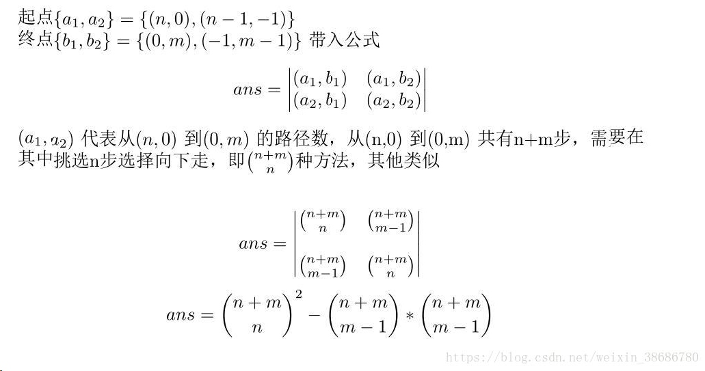

* [nowcoder contest 1](https://www.nowcoder.com/acm/contest/139/#question)
## A. Monotonic Matrix
* **题目大意** ： 给定n, m表示n×m的矩阵，所有点只能填0, 1, 2且每个点的数值小于等于右边及下面的数值，求方案数对(1e9 + 7)取模。
* **大体思路** ： 填充方案数实际就是01和12分界线的方案数，即从`(n, 0)`到`(0, m)`的两条可重合但不相交的分界线方案数。可进一步转换为从`(n, 0)`到`(0, m)`和从`(n - 1, -1)`到`(-1, m - 1)`的两条严格不相交的路径。利用[LGV算法](/Lindström–Gessel–Viennot_lemma.pdf)得到答案。组合数利用 **杨辉三角** 打表即可。 （矩阵规格是`n*m`的但路径规格是`(n+1)*(m+1)`，一开始连这个都看错了噗）



```c++
#include <bits/stdc++.h>

using namespace std;
typedef long long LL;

const int maxn = 2005;
const int mod = int(1e9 + 7);
LL c[maxn][maxn];
int n, m;

void ini() {

    for (int n = 0; n < maxn; n++) {
        c[n][0] = c[n][n] = 1;
        for (int i = 1; i < n; i++)
            c[n][i] = (c[n - 1][i] + c[n - 1][i - 1]) % mod;
    }
}
int main() {

    ios::sync_with_stdio(false), cin.tie(nullptr), cout.tie(nullptr);
    ini();
    while (cin >> n >> m) {
        cout << (c[n + m][n] * c[n + m][n] % mod - c[n + m][n - 1] * c[n + m][m - 1] % mod + mod) % mod << endl;
    }

    return 0;
}
```

* 类似题目：[codeforces 348D](https://codeforces.com/contest/348/problem/D)，问在有障碍图中从左上到右下的两条不同路线的方案数。[代码](https://github.com/KingJoySaiy/Iterator/blob/master/%E5%A4%9A%E6%A0%A1%E8%AE%AD%E7%BB%83/2018%20Nowcoder%20Contest%201/code/cf_948d.cpp)

