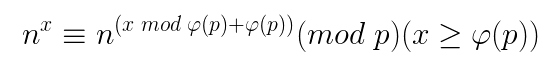
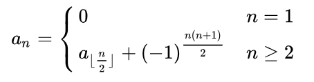

* [nowcoder contest 4](https://www.nowcoder.com/acm/contest/142#question)

## A. Ternary String （打表找规律 + 快速幂 + 欧拉降幂）
* **题目大意** : 给定由012构成的字符串，每次将2后添1，1后添0并删去首字符，问成为空串的时间。
* **大体思路** : 设`f(n)`表示当前时间为n，删掉下一个数及其产生的所有数字所花的时间，易知`f0(n) = n + 1`， `f1(n) = 2 * n + 2`，而`f2(n)`比较难求，打表222就会爆。可以发现`n + 1`秒后才会删除2，此时2后面产生了`n + 1`个1，并且每个1后面分别由`0, 1, 2...n`个0，可以将后面几个1 **打表**， 令`a[n]`表示删除第n个数及其产生的0所花的时间，由递推式`a[n] = 2 * a[n - 1] + 1`，用 **迭代法** 求得数列通项公式为`a[n] = 3 * 2^n - 1`，前n项和`s[n] = 6 * 2^n - n - 4` （下标从0开始），加上前面花的`n + 1`时间，得到`f2(n) = 6 * 2^n - 3`。这样就能从最后一个数字往前依次递归，但是f2中n出现在指数上，比较大又不能直接取模，所以要用到如下的 **欧拉降幂公式** :


* 需要预处理可能用到的 **欧拉函数** 表，否则会超时。此外由于每次取模不一样，mod尽量别定义全局变量，不然可能会因为莫名其妙的原因wa到哭。

```c++
#include<bits/stdc++.h>

using namespace std;
typedef long long LL;

LL mmp = LL(1e9 + 7), ct = mmp;
map<LL, LL> phi;
string a;

LL mod_pow(LL x, LL n, LL mod) {

    LL res = 1;
    while (n) {
        if (n % 2) (res *= x) %= mod;
        (x *= x) %= mod;
        n >>= 1;
    }
    return res;
}
LL eular(LL n) {

    LL res = n;
    for (int i = 2; i * i <= n; i++)
        if (n % i == 0) {
            res -= res / i;
            while (n % i == 0) n /= i;
        }
    return n > 1 ? (res - res / n) : res;
}
LL work(int id, LL mod) {

    if (id == -1) return 0;
    if (a[id] == '0') return work(id - 1, mod) + 1;
    if (a[id] == '1') return (work(id - 1, mod) * 2 + 2) % mod;
    return ((6 * mod_pow(2, work(id - 1, phi[mod]), mod) - 3) % mod + mod) % mod;
}
int main() {

    ios::sync_with_stdio(false), cin.tie(nullptr), cout.tie(nullptr);
    while (ct != 1) ct = phi[ct] = eular(ct);
    phi[1] = 1;

    cin >> ct;
    while (ct--) {
        cin >> a;
        cout << work(a.length() - 1, mmp) << endl;
    }

    return 0;
}
```

## C. Chiaki Sequence Reloaded （找规律 + 数位dp）
* **题目大意** : 对于给定的如下公式，求前n项绝对值之和。



* **大体思路** ：先观察`(-1) ^ n*(n+1)/2` (设为`s[n]`) 发现周期为4，n对4取模为0或3则为1，否则为-1，进而理解为`s[n]`只和n的二进制后2为有关，后两位相同则+1，否则-1。而原数列可以经过如下 **迭代展开** :
```
a[n] = s[n] + a[n / 2] = s[n] + s[n / 2] + a[n / 4]...
= s[n] + s[n / 2] + s[n / 4] ... + s[1] + a[1]
```

* 又因为`a[1] = 0`，所以`a[n]`直接与`s[n]`有关。n每次判断二进制后2为是否相等并右移一位，可以理解为n转为二进制数后相邻相等次数减相邻不等的次数。然后就用到 **数位dp** ，从第一个1开始往右扫，注意每次只能往小于等于n的方向上填数即可。

```c++
#include <bits/stdc++.h>

using namespace std;
typedef long long LL;

const int mod = int(1e9 + 7);
const int maxn = 70;
int dp[maxn][2 * maxn][3], a[maxn], len, ct;
LL n;

int dfs(int id, int ct, int pre, bool flag) {

    if (id == -1) return abs(ct - maxn);
    if (!flag and dp[id][ct][pre] != -1) return dp[id][ct][pre];

    int up = flag ? a[id] : 1, res = 0;
    for (int i = 0; i <= up; i++) {
        if (pre == 2) res += dfs(id - 1, ct, i == 1 ? i : pre, flag and i == up);
        else res += dfs(id - 1, ct + (i == pre ? 1 : -1), i, flag and i == up);
    }
    if (!flag) dp[id][ct][pre] = res % mod;
    return res % mod;
}
void work() {

    cin >> n;
    len = 0;
    while (n) {
        a[len++] = int(n % 2);
        n >>= 1;
    }
    cout << dfs(len - 1, maxn, 2, true) << endl;
}
int32_t main() {

    ios::sync_with_stdio(false), cin.tie(nullptr), cout.tie(nullptr);
    memset(dp, -1, sizeof(dp));
    for (cin >> ct; ct; ct--) work();

    return 0;
}
```

## D. Another Distinct Values (打表找规律 + 构造)
* **题目大意** ： 构造一个n*n的矩阵，只能填入`-1, 0, 1`，使得每行总和与每列总和的`2 * n`个数互不相同。
* **大体思路** ： dfs一下找规律，复杂度有点高只能打出前4个表。看了一下一般规律是以正对角线划分， **上三角矩阵** 都是-1， **下三角矩阵** 都是1，对角线一半是0， 一半是1。
```c++
#include <bits/stdc++.h>

using namespace std;

int n, ct;

void solve() {

    cin >> n;
    if (n % 2) {
        cout << "impossible" << endl;
        return;
    }
    cout << "possible" << endl;
    for (int i = 0; i < n; i++) {
        for (int j = 0; j < n; j++) {
            cout << (i == j ? (i < n / 2) : (i < j) ? -1 : 1) << " \n"[j == n - 1];
        }
    }
}
int main() {

    cin >> ct;
    while (ct--) solve();

    return 0;
}
```

## F. Beautiful Garden （模拟）
* **题目大意** : 在一个长宽都是偶数的字符矩阵中心覆盖一个矩阵，使其余部分上下左右都对称，求覆盖方案数。
* **大体思路** : 矩阵中所有不对称的点都要被覆盖掉，用`(x, y)`分别记录不对称点距离中心的最大横向距离和纵向距离，答案即为`(n - x) * (m - y) / 4`。由于覆盖的矩阵不能为空，特判一下当边长为0时改为2即可。

```c++
#include <bits/stdc++.h>

using namespace std;

const int maxn = 2005;
char a[maxn][maxn];
int n, m, ct;

void solve() {

    cin >> n >> m;
    for (int i = 1; i <= n; i++)
        for (int j = 1; j <= m; j++) cin >> a[i][j];

    int x = 0, y = 0;
    for (int i = 1; i <= n; i++) {
        for (int j = 1; j <= m; j++) {
            if (a[i][j] != a[n + 1 - i][j]) x = max(x, 2 * abs(n / 2 - i));
            if (a[i][j] != a[i][m + 1 - j]) y = max(y, 2 * abs(m / 2 - j));
        }
    }
    if (!x) x = 2;
    if (!y) y = 2;
    cout << (n - x) * (m - y) / 4 << endl;
}
int main() {

    ios::sync_with_stdio(false), cin.tie(nullptr), cout.tie(nullptr);
    cin >> ct;
    while (ct--) solve();

    return 0;
}
```

## G. Maximum Mode (贪心 + 模拟)
* **题目大意** ： 给定n个数，求删除m个数后出现次数最多的数的最大值（最多次数不能相同）。
* **大体思路** ： 用2个map分别记录`(num， ct)`和`(ct, nums)`，其中num为数，ct为数出现次数。从最大的数开始贪心，所有出现次数（设为cm）大于等于该数出现次数（设为c）的数都至少要减去`cm - c + 1`才能使得该数出现次数最大，若减去的此处小于等于m则该数满足条件，否则往下一个大的数继续贪心。

```c++
#include <bits/stdc++.h>

using namespace std;

map<int, int> all;       //first -> num, second -> ct
map<int, set<int>> a;    //first -> ct, second -> nums
int n, m, ct, x;

void solve() {

    a.clear();
    all.clear();
    cin >> n >> m;
    while (n--) {
        cin >> x;
        all[x]++;
    }
    for (auto &p : all) a[p.second].insert(p.first);
    for (auto p = all.rbegin(); p != all.rend(); p++) {
        int res = p->first, ct = p->second, sum = 0;
        for (auto &k : a) {
            if (k.first >= ct) sum += (k.second.size() - (k.first == ct)) * (k.first - ct + 1);
        }
        if (sum <= m) {
            cout << res << endl;
            return;
        }
    }
    cout << -1 << endl;
}
int main() {

    ios::sync_with_stdio(false), cin.tie(nullptr), cout.tie(nullptr);
    cin >> ct;
    while (ct--) solve();

    return 0;
}
```

## J. Hash Function （拓扑排序 / 线段树 /  优先队列 + 并查集）
* **题目大意** ： 给定用数组存储的 **哈希表** ， **线性探测法** 处理 **哈希冲突** ，要求构造字典序最小的插入顺序。
* **大体思路** ： 易知对于没有哈希冲突的数 (即`a[i] % n = i`)，其插入顺序任意，而其他有哈希冲突的数必须等待带插入位置`a[i] % n`到最终位置都填好数后才能插入。想到用一个 **最小堆** (即 **优先队列** ) 维护当前能以任意顺序插入的数，一开始所有没有哈希冲突的数都应该压入优先队列中。然后不妨用 **并查集** 的父节点维护当前节点出现哈希冲突后能插入的位置，每次取出无哈希冲突的数并找到下一个能插入的位置，若该位置是有待插入的数则压入优先队列，这样从最小堆中一个个取数，最后的结果必然字典序最小。其 **并查集** 维护的复杂度为`O(n)`，比用 **拓扑排序构图** 和 **线段树维护** 的`O(nlogn)`方法更优。

```c++
#include <bits/stdc++.h>

using namespace std;
const int maxn = int(2e5 + 5);
struct data {

    int x, id;
    data (int x = 0, int id = 0) : x(x), id(id) {}
    bool operator < (const data &t) const {
        return x > t.x;
    }
};
int a[maxn], fa[maxn], res[maxn];
int ct, n;

int find(int x) {

    return fa[x] == x ? x : fa[x] = find(fa[x]);
}
void solve() {

    priority_queue<data> all;
    cin >> n;
    int ct = 0, has = 0, id;
    for (int i = 0; i < n; i++) {
        cin >> a[i];
        fa[i] = i;
        ct += a[i] != -1;
        if (a[i] % n == i) {        //无冲突的元素
            all.push(data(a[i], i));
            a[i] = -1;              //标记不可填入
        }
    }

    data t;
    while (!all.empty()) {
        t = all.top(); all.pop();
        res[has++] = t.x;
        id = fa[find(t.id)] = find((t.id + 1) % n);      //合并为下一个能放的索引
        if (a[id] != -1 and find(a[id] % n) == id) {     //将能安放的数压入最小堆
            all.push(data(a[id], id));
            a[id] = -1;
        }
    }

    if (!ct) cout << endl;
    else if (has < ct) cout << "-1" << endl;
    else {
        for (int i = 0; i < has; i++)
            cout << res[i] << " \n"[i == has - 1];
    }
}
int main() {

    ios::sync_with_stdio(false), cin.tie(nullptr), cout.tie(nullptr);
    cin >> ct;
    while (ct--) solve();

    return 0;
}
```


