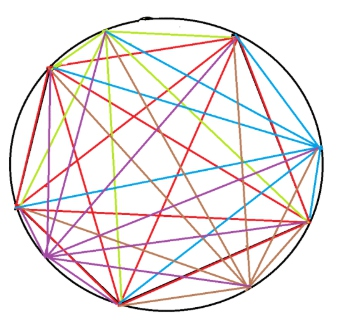

* [nowcoder contest 7](https://www.nowcoder.com/acm/contest/145#question)
* [nowcoder contest 8](https://www.nowcoder.com/acm/contest/146#question)
## 7_A. Minimum Cost Perfect Matching（找规律 + 暴力）
* **题目大意** ： 构造`[0, n)`的n个数，满足`sigma(i ^ a[i])`最小。
* **大体思路** ： 打表找规律，观察到构造的 **异或和** 最小都是0，意味着每一位异或值都是0。然后观察到 **降序枚举** 比升序枚举快，直接暴力模拟一下即可。
```c++
#include <bits/stdc++.h>

using namespace std;

const int maxn = int(5e5 + 5);
int res[maxn], n, id;

int main() {

    cin >> n;
    memset(res, -1, sizeof(res));
    for (int k = n - 1; ~k; k--) {
        while (true) {
            if (res[id] == -1 and !(id & k)) break;
            id = (id + 1) % n;
        }
        res[id] = k;
    }
    for (int i = 0; i < n; i++) cout << res[i] << " \n"[i == n - 1];

    return 0;
}
```

## 7_C. Bit Compression（暴力 + 剪枝）
* **题目大意** ： 给定长度为`2 ^ n`的01串，执行n次相邻2位取`& | ^`三种逻辑运算，求最后为串为1的方案数。
* **大体思路** ：（ **折半搜索** 很尴尬的T了）看到一种很好的做法是开一个 **二维数组** 或 **unordered_map** 记录处理后的字符串以及出现次数，将维护的出现次数每次叠加，最后输出长度为1且串为1的记录点即可。
```c++
#include<bits/stdc++.h>

using namespace std;

unordered_map<string, int> a[20];
string s;
int len, n;

int main() {

    cin >> n >> s;
    for (auto &p : s) p -= '0';
    a[n][s] = 1;
    while (n--) {
        for (auto p : a[n + 1]) {
            s = p.first;
            len = 1 << (n + 1);
            string t[3];
            for (int i = 0; i < len; i += 2) {
                t[0] += s[i] & s[i + 1];
                t[1] += s[i] | s[i + 1];
                t[2] += s[i] ^ s[i + 1];
            }
            for (int i = 0; i < 3; i++) a[n][t[i]] += p.second;
        }
    }
    cout << a[0][string(1, 1)] << endl;

    return 0;
}
```

## 7_E. Counting 4-Cliques (构造 + 暴力)
* **题目大意** ： 定义G图为有4个节点的 **无向完全图**（无重边和自环），试构造有k个G图的无向图，满足节点数不超过75。
* **大体思路** ： 在完全图中G图的个数为`c[t][4]`，考虑在此基础上在加上若干节点和边，使得再多出`k - c[t][4]`个G图，其中t表示满足`c[i][4] ≤ k`的最大i。不难证明对于新节点，设其度为x，则增加了`c[x][3]`个G图。由于`c[72][4]`才大于1e6，故t最大值为71，考虑枚举4个点会WA，说明4个点无法枚举所有情况。从而令t最大为70，枚举5个点，若能得到`k - c[t][4]`则直接输出即可。
```c++
#include <bits/stdc++.h>
#define pri(x, y) cout << x << ' ' << y << endl

using namespace std;

const int maxn = 80;
int ok[int(1e5)], c3[maxn], c4[maxn];
int res[5], t = 4, k, sum;

void work() {

    pri(t + 5, t * (t - 1) / 2 + res[0] + res[1] + res[2] + res[3] + res[4]);
    for (int i = 1; i <= t; i++) {
        for (int j = i + 1; j <= t; j++) pri(i, j);
    }
    for (int i = 0; i < 5; i++) {
        for (int j = 1; j <= res[i]; j++) pri(j, t + i + 1);
    }
}
int main() {

    ios::sync_with_stdio(false), cin.tie(), cout.tie();
    for (int i = 2; i < 71; i++) c3[i] = i * (i - 1) * (i - 2) / 6, ok[c3[i]] = i;
    for (int i = 4; i < maxn; i++) c4[i] = i * (i - 1) * (i - 2) * (i - 3) / 24;
    cin >> k;
    while (c4[t] <= k) t++; t--;
    k -= c4[t = min(t, 70)];
    for (int a = 2; a <= t; a++) {
        for (int b = a; b <= t; b++) {
            for (int c = b; c <= t; c++) {
                for (int d = c; d <= t; d++) {
                    sum = c3[a] + c3[b] + c3[c] + c3[d];
                    if (sum > k) break;
                    if (bool(res[4] = ok[k - sum])) {
                        res[0] = a, res[1] = b, res[2] = c, res[3] = d;
                        work();
                        return 0;
                    }
                }
            }
        }
    }

    return 0;
}
```

## 7_J. Sudoku Subrectangles （思维 / dp）
* **题目大意** ： 给定n*m的 **字符矩阵** ，求有多少个 **数独矩阵**（每行每列字符都不相同），保证字符是英文字符。
* **大体思路** ： 直接暴力肯定不行，考虑枚举数独矩阵的左上角，再求出最大满足条件的矩阵大小。可以先预处理从某位置开始向右最长距离，和向下最长距离，满足字符互不相同。然后针对枚举的每个位置（作为左上角），逐行加上可以作为数独矩阵右下角的个数即可，从而复杂度降到`52 * n * m`。
```c++
#include <bits/stdc++.h>
#define right rr

using namespace std;
const int maxn = 1005;
int right[maxn][maxn], down[maxn][maxn], h[maxn], k;
int flag[150], id, n, m;
char s[maxn][maxn];
long long res;

int main() {

    ios::sync_with_stdio(false), cin.tie(), cout.tie();
    cin >> n >> m;
    for (int i = 0; i < n; i++) cin >> s[i];
    for (int i = 0; i < n; i++) {
        for (int j = 0; j < m; j++) {
            for (id++, k = j; k < m and flag[s[i][k]] != id; k++) flag[s[i][k]] = id;
            right[i][j] = k - j;
            for (id++, k = i; k < n and flag[s[k][j]] != id; k++) flag[s[k][j]] = id;
            down[i][j] = k - i;
        }
    }
    for (int i = 0; i < n; i++) {
        for (int j = 0; j < m; j++) {
            for (h[j] = down[i][j], k = j + 1; k < j + right[i][j]; k++) h[k] = min(h[k - 1], down[i][k]);
            for (id = i + 1, k = j + right[i][j] - 1; id < i + down[i][j]; id++) {
                for (k = min(k, j + right[id][j] - 1); k >= j and h[k] < id - i + 1;) k--;
                if (k < j) break;
                res += k - j + 1;
            }
            res += right[i][j];
        }
    }
    cout << res << endl;

    return 0;
}
```

## 8_B. Filling pools
（占坑）

## 8_E. Touring cities （找规律）
* **题目大意** ： 在n*m矩阵中从`(1, 1)`出发再回到圆点，让每个点都走过，求最小步数。每次可到相邻点或k个直达路径。
* **大体思路** ： 首先发现若n和m中有一个是偶数，则不用考虑直达情况，可以直接走`n * m`步。考虑都是奇数的情况，问题转换为 **棋盘染色问题** ，对于x和y同奇偶的染白色，否则染黑色，发现白棋比黑棋多一个，则若存在两不同白棋连通（即存在直达路径），则视为两者为整体，从而白棋和黑棋个数相等，存在这样的一个 **汉密尔顿回路** 。
```c++
#include <bits/stdc++.h>

using namespace std;

int a, b, c, d, n, m, k, ct;
bool flag;

void solve() {

    cin >> n >> m >> k;
    flag = n % 2 and m % 2;
    while (k--) {
        cin >> a >> b >> c >> d;
        if ((a != c or b != d) and (a + b) % 2 == 0 and (c + d) % 2 == 0) flag = false;
    }
    cout << n * m + flag << endl;
}
int main() {

    ios::sync_with_stdio(false), cin.tie(), cout.tie();
    cin >> ct;
    while (ct--) solve();

    return 0;
}
```

## 8_G. Counting regions （欧拉公式 + 组合数学）
* **题目大意** ： 有n个顶点的正多边形顶点两两相连，求多边形内部区域个数。
* **大体思路** ：先看 [uva #10213](https://uva.onlinejudge.org/index.php?option=com_onlinejudge&Itemid=8&page=show_problem&problem=1154)这道题，题意就是圆内n个点两两相连求圆内区域个数。


在平面图中，有 **欧拉公式** `F = E - V + 2`，V为顶点数，E为边数，F是面数，故可以由边数和顶点数求得面数，减去1个外部无限大的区域，得到`F = E - V + 1`。枚举从一固定点出发（答案要乘以n）的对角线，其左边有i个点，右边有`n - 2 - i`个点，其左右点的连线在这条对角线上形成`i * (n - 2 - i)`个交点，每个点被重复计算4次，再加上多边形本身的n个顶点，从而得到：


* 同理每次得到`i * (n - 2 - i) + 1`条线段，且每条线段被重复计算2次，在加上多边形本身的n条边和圆被划分的n条弧（也算边），从而得到：


* 从而得到`F = (n^4 - 6 * n^3 + 23 * n^2 - 18 * n) / 24 + 1`。而本题中只需减掉圆内多出的n个区域即为答案，故：


```c++
#include<bits/stdc++.h>

using namespace std;
typedef long long LL;

const int mod = int(1e9 + 7);
LL n, ni = 41666667;     //24_ni

LL ppow(LL x, LL n) {

    LL res = 1;
    while (n) {
        if (n & 1) res = res * x % mod;
        x = x * x % mod;
        n >>= 1;
    }
    return res;
}
int main() {

    while (cin >> n) {
        cout << ((ppow(n, 4) - 6 * ppow(n, 3) + 23 * ppow(n, 2) - 42 * n + 24) % mod * ni % mod + mod) % mod << endl;
    }

    return 0;
}
```
## 8_H. Playing games
（占坑）

* [nowcoder contest 9](https://www.nowcoder.com/acm/contest/147#question)
* [nowcoder contest 10](https://www.nowcoder.com/acm/contest/148#question)
## 9_A. Circulant Matrix

## 9_E. Music Game （概率 + 期望）
* **题目大意** ： 给定n个数，表示第i次答对概率为`a[i] / 100`，连续答对k次得分`k ^ m`，问总得分的期望。
* **大体思路** ： 可以对每段的期望求和，而不必考虑总的答题情况。设`p(i, j)`表示ij闭区间内都连对的概率，则`p(i, j) = sigma{k = i : j}{a[i] / 100}`。设`f(i, j)`表示i，j位置答错（或为边界），而在其开区间内连对的概率，则`f(i, j) = (100 - a[i]) / 100 * (100 - a[j]) / 100 * p(i + 1, j - 1)`，对每个f再乘上得分值即可。
```c++
#include <bits/stdc++.h>

using namespace std;
typedef long long LL;

const int mod = int(1e9 + 7);
const int maxn = 1005;
const int ni = 570000004;
LL a[maxn][maxn], score[maxn];
LL x, good[maxn], bad[maxn], res;
int n, m;

LL mod_pow(LL x, LL n) {

    LL res = 1;
    while (n) {
        if (n % 2) res = res * x % mod;
        x = x * x % mod;
        n >>= 1;
    }
    return res;
}
int main() {

    ios::sync_with_stdio(false), cin.tie(), cout.tie();
    cin >> n >> m;
    for (int i = 1; i <= n; i++) {
        cin >> x;
        good[i] = x * ni % mod;
        bad[i] = (100 - x) * ni % mod;
        score[i] = mod_pow(i, m);
    }
    bad[0] = bad[n + 1] = 1;
    for (int i = 1; i <= n; i++) {
        a[i][i] = good[i];
        for (int j = i + 1; j <= n; j++) a[i][j] = a[i][j - 1] * good[j] % mod;
    }
    for (int i = 0; i <= n; i++) {
        for (int j = i + 2; j < n + 2; j++) {
            (res += bad[i] * bad[j] % mod * a[i + 1][j - 1] % mod * score[j - i - 1] % mod) %= mod;
        }
    }
    cout << (res + mod) % mod << endl;

    return 0;
}
```

## 9_F. Typing practice

## 9_H. Prefix Sum

## 10_A. Rikka with Lowbit

## 10_D. Rikka with Prefix Sum

## 10_F. Rikka with Line Graph

## 10_J. Rikka with Nickname （大模拟 + 二分）
* **题目大意** ：给定n个字符串进行拼接，从第二个开始去掉最长前缀拼在已有串后面，满足前缀是已有串的子串。
* **大体思路** ： 由于只含小写英文字母，故想到用`id[26][maxn]`存储每个字母再已有串中的所有下标。依次处理每个串的每个 **前缀字符** ，不断 **二分** 该字符出现的下标now，并更新now。当找不到比now大的下标或到达串尾则结束，输出最终串即可。
```c++
#include <bits/stdc++.h>

using namespace std;

const int maxn = int(1e6 + 5);
char res[maxn], s[maxn];
int id[26][maxn], l[26];
int n, m, p, len, ct;

void work() {

    len = strlen(s);
    long now = -1, t, c;
    for (p = 0; p < len; p++) {
        c = s[p] - 'a';
        if ((t = lower_bound(id[c], id[c] + l[c], now + 1) - id[c]) != l[c]) now = id[c][t];
        else return;
    }
}
void solve() {

    cin >> m >> res;
    n = strlen(res);
    memset(l, 0, sizeof(l));
    for (int i = 0; i < n; i++) id[res[i] - 'a'][l[res[i] - 'a']++] = i;
    while (--m) {
        cin >> s;
        work();
        for (int i = p; i < len; i++) {
            id[s[i] - 'a'][l[s[i] - 'a']++] = n;
            res[n++] = s[i];
        }
    }
    res[n] = '\0';
    cout << res << endl;
}
int main() {

    ios::sync_with_stdio(false), cin.tie(), cout.tie();
    cin >> ct;
    while (ct--) solve();

    return 0;
}
```


