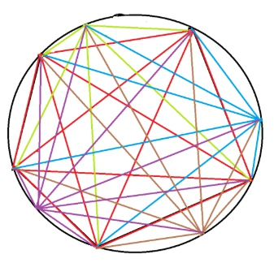
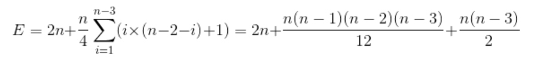

* [nowcoder contest 7](https://www.nowcoder.com/acm/contest/145#question)
* [nowcoder contest 8](https://www.nowcoder.com/acm/contest/146#question)
## 7_A. Minimum Cost Perfect Matching（找规律 + 暴力）
* **题目大意** ： 构造`[0, n)`的n个数，满足`sigma(i ^ a[i])`最小。
* **大体思路** ： 打表找规律，观察到构造的 **异或和** 最小都是0，意味着每一位异或值都是0。然后观察到 **降序枚举** 比升序枚举快，直接暴力模拟一下即可。
```c++
#include <bits/stdc++.h>

using namespace std;

const int maxn = int(5e5 + 5);
int res[maxn], n, id;

int main() {

    cin >> n;
    memset(res, -1, sizeof(res));
    for (int k = n - 1; ~k; k--) {
        while (true) {
            if (res[id] == -1 and !(id & k)) break;
            id = (id + 1) % n;
        }
        res[id] = k;
    }
    for (int i = 0; i < n; i++) cout << res[i] << " \n"[i == n - 1];

    return 0;
}
```

## 7_C. Bit Compression（暴力 + 剪枝）
* **题目大意** ： 给定长度为`2 ^ n`的01串，执行n次相邻2位取`& | ^`三种逻辑运算，求最后为串为1的方案数。
* **大体思路** ：（ **折半搜索** 很尴尬的T了）看到一种很好的做法是开一个 **二维数组** 或 **unordered_map** 记录处理后的字符串以及出现次数，将维护的出现次数每次叠加，最后输出长度为1且串为1的记录点即可。
```c++
#include<bits/stdc++.h>

using namespace std;

unordered_map<string, int> a[20];
string s;
int len, n;

int main() {

    cin >> n >> s;
    for (auto &p : s) p -= '0';
    a[n][s] = 1;
    while (n--) {
        for (auto p : a[n + 1]) {
            s = p.first;
            len = 1 << (n + 1);
            string t[3];
            for (int i = 0; i < len; i += 2) {
                t[0] += s[i] & s[i + 1];
                t[1] += s[i] | s[i + 1];
                t[2] += s[i] ^ s[i + 1];
            }
            for (int i = 0; i < 3; i++) a[n][t[i]] += p.second;
        }
    }
    cout << a[0][string(1, 1)] << endl;

    return 0;
}
```

## 7_E. Counting 4-Cliques
（占坑）

## 7_J. Sudoku Subrectangles
（占坑）

## 8_B. Filling pools
（占坑）

## 8_E. Touring cities
（占坑）

## 8_G. Counting regions （欧拉公式 + 组合数学）
* **题目大意** ： 有n个顶点的正多边形顶点两两相连，求多边形内部区域个数。
* **大体思路** ：先看 [uva #10213](https://uva.onlinejudge.org/index.php?option=com_onlinejudge&Itemid=8&page=show_problem&problem=1154)这道题，题意就是圆内n个点两两相连求圆内区域个数。


在平面图中，有 **欧拉公式** `F = E - V + 2`，V为顶点数，E为边数，F是面数，故可以由边数和顶点数求得面数，减去1个外部无限大的区域，得到`F = E - V + 1`。枚举从一固定点出发（答案要乘以n）的对角线，其左边有i个点，右边有`n - 2 - i`个点，其左右点的连线在这条对角线上形成`i * (n - 2 - i)`个交点，每个点被重复计算4次，再加上多边形本身的n个顶点，从而得到：


* 同理每次得到`i * (n - 2 - i) + 1`条线段，且每条线段被重复计算2次，在加上多边形本身的n条边和圆被划分的n条弧（也算边），从而得到：



* 从而得到`F = (n^4 - 6 * n^3 + 23 * n^2 - 18 * n) / 24 + 1`。而本题中只需减掉圆内多出的n个区域即为答案，故：


```c++
#include<bits/stdc++.h>

using namespace std;
typedef long long LL;

const int mod = int(1e9 + 7);
LL n, ni = 41666667;     //24_ni

LL ppow(LL x, LL n) {

    LL res = 1;
    while (n) {
        if (n & 1) res = res * x % mod;
        x = x * x % mod;
        n >>= 1;
    }
    return res;
}
int main() {

    while (cin >> n) {
        cout << ((ppow(n, 4) - 6 * ppow(n, 3) + 23 * ppow(n, 2) - 42 * n + 24) % mod * ni % mod + mod) % mod << endl;
    }

    return 0;
}
```
## 8_H. Playing games
（占坑）


