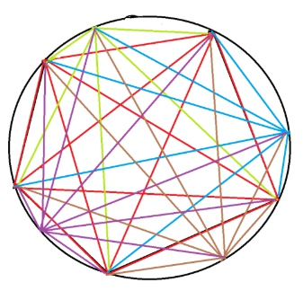
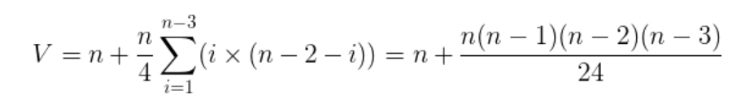
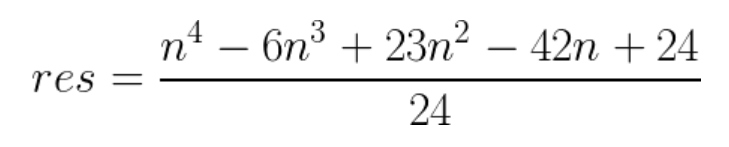

* [nowcoder contest 8](https://www.nowcoder.com/acm/contest/146#question)

## B. Filling pools

## E. Touring cities

## G. Counting regions （欧拉公式 + 组合数学）
* **题目大意** ： 有n个顶点的正多边形顶点两两相连，求多边形内部区域个数。
* **大体思路** ：先看 [uva #10213](https://uva.onlinejudge.org/index.php?option=com_onlinejudge&Itemid=8&page=show_problem&problem=1154)这道题，题意就是圆内n个点两两相连求圆内区域个数。


在平面图中，有 **欧拉公式** `F = E - V + 2`，V为顶点数，E为边数，F是面数，故可以由边数和顶点数求得面数，减去1个外部无限大的区域，得到`F = E - V + 1`。枚举从一固定点出发（答案要乘以n）的对角线，其左边有i个点，右边有`n - 2 - i`个点，其左右点的连线在这条对角线上形成`i * (n - 2 - i)`个交点，每个点被重复计算4次，再加上多边形本身的n个顶点，从而得到：



* 同理每次得到`i * (n - 2 - i) + 1`条线段，且每条线段被重复计算2次，在加上多边形本身的n条边和圆被划分的n条弧（也算边），从而得到：


* 从而得到`F = (n^4 - 6 * n^3 + 23 * n^2 - 18 * n) / 24 + 1`。而本题中只需减掉圆内多出的n个区域即为答案，故：



```c++
#include<bits/stdc++.h>

using namespace std;
typedef long long LL;

const int mod = int(1e9 + 7);
LL n, ni = 41666667;     //24_ni

LL ppow(LL x, LL n) {

    LL res = 1;
    while (n) {
        if (n & 1) res = res * x % mod;
        x = x * x % mod;
        n >>= 1;
    }
    return res;
}
int main() {

    while (cin >> n) {
        cout << ((ppow(n, 4) - 6 * ppow(n, 3) + 23 * ppow(n, 2) - 42 * n + 24) % mod * ni % mod + mod) % mod << endl;
    }

    return 0;
}
```
## H. Playing games

