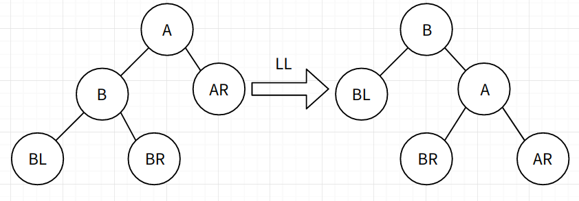
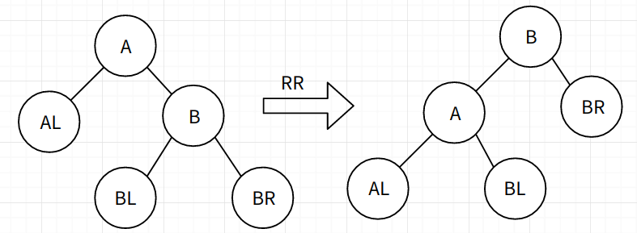

## 一、文件c语言

## 二、线性表, 栈, 队列, 数组

### 2.1 线性表

- 线性表有 **顺序实现** 和 **链式实现**（起始地址*base, 当前长度len，总长度size） ，链式分为 **单链表**（分为带头结点和不带头结点）、**循环单链表**（head->next=null则空表，须有头指针或尾指针，无头结点）、**双向链表**（有头结点）。
- **链表头结点** ：不带头结点是指head是直接指向首结点的指针，即`head->data`为首结点数据；带头结点是指头结点为多余的新结点，其数据域无意义，指针域指向首结点，即`head->next->data`为首结点数据。单链表带头结点的好处是可以在表头插入结点。
- [List代码实现](https://github.com/KingJoySaiy/Iterator/blob/master/Data%20Structure/List.h)

### 2.3 栈和队列

- **顺序栈**（起始地址* base，栈顶* top，总长度size）；**链栈**（带头结点的单链表，头插法）。
- [Stack代码实现](https://github.com/KingJoySaiy/Iterator/blob/master/Data%20Structure/Stack.h)
- **链队列**（结点QNode[data, *next]，队列Queue[QNode front, rear]）；**顺序循环队列**（ * base，front，rear），注意取模，(rear+1)%maxsize==front则满。
- [Queue代码实现](https://github.com/KingJoySaiy/Iterator/blob/master/Data%20Structure/Queue.h)

### 2.4 数组

- 数组一旦确定了维数和每一维的元素个数，就确定了整个数组元素个数，故只需用顺序实现即可。其顺序存储结构有：以行为主序和以列为主序，在此只讨论以行序为主序。

以二维数组为例，* base为基址， * bounds为每一维元素个数（从1开始），L为每个数据元素所占存储单元，则有 $ (i,j)=base+(bounds_i×i+j)L $ 。例如3 * 4的二维矩阵中(1,2)相对于基址base的偏移量为 $4 *1+2=6$。

- 推广到n维，有$(j_1,j_2...j_n)=a+[\sum_{i=1}^{n-1}(j_i\prod_{k=i+1}^nb_k)]L$ ，可设constants（$c_n=L, c_{i-1}=b_i×c_i$）从而有 $(j_1,j_2...j_n)=a+L\sum_{i=1}^nc_i$ 。从而**（基址 * base, 维数dim, 每一维元素个数 * bounds，各维数+1时相对基址移动距离 * constants）**。

* [Array代码实现](https://github.com/KingJoySaiy/Iterator/blob/master/Data%20Structure/Array.h)

- **矩阵压缩**：对称矩阵、三角矩阵、对角矩阵算一算下标存到顺序表即可；稀疏矩阵用（i, j, data）存到顺序表（truple *base, 行数n, 列数m, 非0元素个数count）中。

## 三、 树和二叉树

### 3.1 树和二叉树

- **非空树**：有且仅有1个根结点，其余结点可分为若干个有限集，每个集合本身又是一棵树（称为子树）。**结点的度**：结点有的子结点个数。**叶子 / 终端结点**：度为0的终端结点（**非终端结点 / 分支结点**反之）。**层次**：根为第1层，根的孩子为第2层，以此类推。**深度 / 高度**：树中结点的最大层次（空树层次为0）。**兄弟结点**：有同一个双亲的结点。**堂兄弟结点**：各自双亲在同一层的结点。**祖先**：从该结点到根所经分支上的所有结点（不含本身，**子孙**即子树中所有结点）。**有序树**：树中结点的各个子树从左到右有序的（**无序树**反之）。**森林**：若干棵不相交的树的集合。
- **二叉树**：度不大于2的有序树。**满二叉树**：深度为k（k≥0）且含有 $2^k-1$ 个结点的二叉树。**完全二叉树**：编号1-n按照满二叉树的结点位置，从根结点起，从上往下从左到右编排（满二叉树是完全二叉树）。
- **二叉树分支数 = 结点数 - 1** ； **度为2的结点数=叶子结点数-1**。
- 有n个结点的完全二叉树深度为 $⌊log_2n⌋-1$ 。
- 完全二叉树**顺序存储**：基址 * base，算一算下标存进去。 **链式存储**：（data, 双亲指针 * parent, 左子节点 * lchild, 右子节点*rchild），parent可以去掉。**双亲表示法**：node（data，双亲位置parent），tree（起始地址 * base，根位置root，结点数n）。**孩子表示法**：list（位置id， * next），node（data，孩子链表 list * children），tree（ * base, root, n）。**二叉链表表示法** ：node（data, 第1个子节点 * firstChild，下一个兄弟结点 * nextSibling），即二维的链表，行即为层数，列即为每行兄弟结点序列。

（二叉树代码实现，占坑）

### 3.2 遍历二叉树、树和森林

- **遍历二叉树**：先序遍历（根左右）；中序遍历（左根右）；后序遍历（左右根）。
- **线索二叉树**（data 左指针 * lchild, 右指针 * rchild，左标记ltag，右标记rtag）的构造：左指针优先指向左子树，若该结点无左子树则指向前驱结点（右指针同理）；标记0表示指向左子结点，为1表示指向前驱结点；头结点左指针指向根结点，右指针指向遍历的最后结点；遍历的第一个结点左指针和最后一个结点右指针，都指向指向头结点。

（递归与非递归遍历二叉树，线索化代码，占坑）

* **森林转化为二叉树** ：若森林空，则二叉树空；否则森林的第一棵树的根作为二叉树的根，第一棵树的子森林转化为二叉树根的左子树，森林除第一棵外的的其余树转化为二叉树根的右子树，依次递归。（特别的，当只有一棵树，转化后的二叉树的根没有右子树；**树也是森林**）。
* **二叉树转化为森林** ：若为空二叉树，则森林空；否则二叉树的根作为森林的第一棵树的根，其左子树转化为森林第一棵树的子森林，右子树转化为森林的其余树，依次递归。

（森林与二叉树的转化代码，占坑）

* **树的遍历**：先根遍历；后根遍历。
* **森林的遍历**：先序遍历（访问第一棵树的根、先序遍历第一棵树的子树森林、先序遍历除第一棵树外的森林）；中序遍历（中序遍历第一棵树的子树森林、访问第一棵树的根、中序遍历除第一棵树外的森林）。
* 注意遍历方式的不同：**二叉树（先序、中序、后序）**；**树（先根、后根）**；**森林（先序、中序）**！

### 3.3 Huffman树

* 树中从一个结点到另一个结点之间的分支构成2结点之间的路径，路径上的分支数目称为 **路径长度**。**树的路径长度** 是从树根到每个结点的路径长度之和。
* 树中所有叶子结点的带权路径长度之和，称为 **树的带权路径长度**，记为$WPL=\sum_{k=1}^nw_kl_k$，$w_k$为每个结点的权值，$l_k$为每个结点的路径长度。WPL最小的二叉树称为 **最优二叉树** 或 **哈夫曼树**。
* **构造Huffman树**：给定n个只含根节点的二叉树，按根节点权值升序；每次取出权值最小的2个二叉树，合并为新的二叉树，新树的根节点权值为二者权值之和；依次类推。
* **Huffman编码**：用二叉树对字符设计二进制的 **前缀编码**（每个字符的编码都不是另一个的前缀），从根节点到叶子节点的分支作为该叶子节点字符的编码（**左0右1**）。$w_k$为每个字符在电文中的出现次数，$l_k$为该字符的编码的长度，则电文总长（带权路径长度） $WPL=\sum_{k=1}^nw_kl_k$最小时，该编码方式称为Huffman编码。
* [Huffman编码c++简单实现](https://github.com/KingJoySaiy/Iterator/blob/master/Data%20Structure/HuffmanCoding.cpp)

## 四、查找, 递归, 分治

### 4.1 动态查找

* **二叉搜索树 / 排序树 / 查找树**：左子树所有节点值都小于根节点值，右子树所有节点值都大于根节点值。
* **平衡二叉树 / AVL树**：左右子树都是平衡二叉树，左右子树深度只差不超过1。**平衡因子**：左子树深度减右子树深度（只可能为-1,0,1）。
*  **平衡处理**：为防止构造二叉搜索树时因插入顺序使之蜕变为单支树，保证其一直为平衡二叉树。**LL右旋平衡处理**如下：

**RR左旋平衡处理**如下：

LL和RR为两种**单向旋转平衡处理**，此外还有**LR先左后右**和**RL先右后左**2种**双向旋转平衡处理**。

### 4.2 B树

（占坑）

### 4.3 哈希表

* **哈希函数**：记录的关键字到存储位置的一种映射关系。**哈希冲突**：不同关键字可能得到同一哈希地址，称之为**同义词**，这种现象称为哈希冲突。**哈希表 / 散列表**：根据设定的哈希函数和处理冲突的方法，将一组关键字映射到一个有限的连续的地址集（区间）上的表。
* **哈希函数的构造法**：①**直接定址**：取关键字的线性函数值为哈希地址，即`hash(key) = a*key + b`；②**除留余数法**：将关键字取模后的结果作为哈希地址，即`hash(key)=key MOD p`，(p≤哈希表长），一般情况下p取质数或不包含小于20的质因数的合数；③**随机数法**：取关键字的随机函数值作为哈希地址，即`hash(key) = random(key)`，适用于关键字长度不等的情况。
* **哈希冲突处理方法**：①**开放地址法**：遇到哈希冲突时继续探测，直到无冲突为止，$hash_i=(hash(key)+d_i)MOD m,（1≤i<m）$，$d_i=1,2,3...m-1$称为 **线性探测**，$d_i=1^2,-1^2,2^2,-2^2,3^2...$称为**二次探测**，$d_i=$伪随机数称为**伪随机探测**；②**再哈希法**：$hash_i=ReHash_i(key)$，即遇到哈希冲突时计算另一个哈希函数地址，直到冲突不再发生；③**链地址法**：将所有同义关键字的记录存到同一线性链表中， 从而避免哈希冲突。④**建立公共溢出区**：除哈希表Hashtable[0...m-1]外，另设溢出表OverTable[0...v]存放发生了哈希冲突的记录。

（哈希表代码实现，占坑）

### 4.4 递归与分治策略

## 五、内部排序

### 5.1 基本概念

* **稳定性**：经过排序后，若原序列中相等的记录次序不变，则称该排序算法是 **稳定的**，否则 **不稳定**。
* **内部排序**：待排序记录存放在计算机随机存储器中进行的排序过程；**外部排序**：待排序记录的数量大到内存一次不能容纳全部记录，在排序过程中需要对外村进行访问的排序过程。
* **排序分类**：分为 **插入排序**（直接插,折半插,希尔）、**交换排序**（交换,快排）、**选择排序**（选择,堆排）、**归并排序**、**计数排序**（桶排） 5大类。

### 5.2 插入排序

* **直接插入排序**：将记录插入到已排好序的有序表中，从而不断得到新的、记录数+1的有序表。排序过程进行`n-1`次插入，每次插入需要往前顺序扫描。先将第1个数视为有序的子序列，然后从第2个记录起依次插入，直到整个序列按关键字有序为止。时间复杂度为`O(n^2)`。
* **折半插入排序**：将新记录插入到原有序序列中时，需要找到待插入的位置，此时可以不用顺序查找，而是用 **折半查找**，从而将时间复杂度降到了`O(nlogn)`。
* **希尔排序**：先将整个序列按照 **希尔增量** 分割为若干子序列，分别进行直接插入排序，再不断减小希尔增量到1，从而完成排序操作。设希尔增量为h，则[0, h, 2h...]为一组，[1, h+1, 2h+1...]为一组，以此类推。希尔增量可以有各种取法，但需注意增量序列公因子必须为1（唯一），且最后一个增量为1。
* [插入排序代码实现](https://github.com/KingJoySaiy/Iterator/tree/master/Data%20Structure/Sort/InsertionSort.h)

### 5.3 交换排序

### 5.4 选择排序

### 5.5 归并排序

### 5.6 计数排序

（占坑）

* [排序实现](https://github.com/KingJoySaiy/Iterator/tree/master/Data%20Structure/Sort)

## 六、动态规划, 贪心

## 七、回溯法, 分支限界法

## 八、概率算法, 近似算法

## 九、线性规划, 网络流